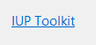

## IupLink

Creates a label that displays an underlined clickable text.
It inherits from [IupLabel](iup_label.md).

### Creation

    Ihandle* IupLink(const char *url, const char * title);

**url**: the destination address of the link. Can be any text. If **IupHelp** is used should be a valid URL.
It can be NULL. It will set the URL attribute.\
**title**: Text to be shown on the link. It can be NULL. It will set the TITLE attribute.

**Returns:** the identifier of the created element, or NULL if an error occurs.

### Attributes

Inherits all attributes and callbacks of the [IupLabel](iup_label.md), but redefines a few attributes.

[FGCOLOR](../attrib/iup_fgcolor.md): Text color. Default: the global attribute LINKFGCOLOR.

**URL**: the default value is "YES".

### Callbacks

[ACTION](../call/iup_action.md): Action generated when the link is activated.

    int function(Ihandle* ih, char *url);

**ih**: identifier of the element that activated the event.\
**url**: the destination address of the link.

**Returns**: IUP_CLOSE will be processed.
If returns IUP_DEFAULT or it is not defined, the **IupHelp** function will be called.

### Notes

When the cursor is over the text, it is changed to the HAND cursor.

If the callback is not defined, the **IupHelp** function is called with the given URL.

The **IupLabel** callbacks BUTTON_CB, ENTERWINDOW_CB and LEAVEWINDOW_CB are used internally.

### Examples

[Browse for Example Files](../../examples/)

### See Also

[IupLabel](iup_label.md), [IupHelp](../func/iup_help.md).
