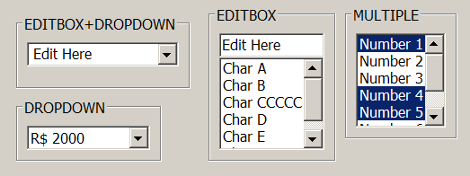
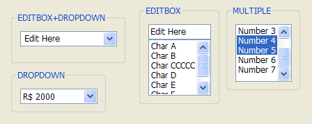
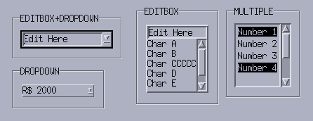
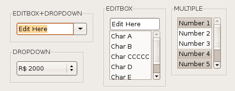

## IupList

Creates an interface element that displays a list of items. The list can be visible or can be dropped down.
It also can have an edit box for text input. So it is a 4 in 1 element.
In native systems, the dropped-down case is called Combo Box.

### Creation

    Ihandle* IupList(const char *action);

**action**: String with the name of the action generated when the state of an item is changed.
It can be NULL.

**Returns:** the identifier of the created element, or NULL if an error occurs.

### Attributes

**"1"**: First item in the list.
**"2"**: Second item in the list.
**"3"**: Third item in the list.
**...**
**"id"**: idth item in the list.

(non-inheritable) The values can be any text. Items before "1" are ignored.
Before map, the first item with a NULL is considered the end of the list and items can be set in any order.
After map, there are a few rules:

- if "1" is set to NULL, all items are removed.
- if "id" is set to NULL, all items after id are removed.
- if "id" is between the first and the last item, the current idth item is replaced. The effect is the same as removing the old item and inserting a new one at the old position.
- if "count+1" is set, then it is appended after the last item.
- Items after "count+1" are ignored.

**APPENDITEM** (write-only): inserts an item after the last item.
Ignored if set before map.

**AUTOHIDE**: scrollbars are shown only if they are necessary. Default: "YES".

**AUTOREDRAW** [Windows] (non-inheritable): automatically redraws the list when something has change.
Set to NO to add many items to the list without updating the display. Default: "YES".

[BGCOLOR](../attrib/iup_bgcolor.md): Background color of the text. Default: the global attribute TXTBGCOLOR.
In GTK does nothing when DROPDOWN=Yes.

**CANFOCUS** (creation-only) (non-inheritable): enables the focus traversal of the control.
In Windows the control will still get the focus when clicked. Default: YES.

**PROPAGATEFOCUS**(non-inheritable): enables the focus callback forwarding to the next native parent with FOCUS_CB defined.
Default: NO.

**COUNT** (read-only) (non-inheritable): returns the number of items.
Before mapping, it counts the number of non-NULL items before the first NULL item.

**DRAGDROPLIST** (non-inheritable): prepare the [Drag & Drop](../attrib/iup_dragdrop.md) callbacks to support drag and drop of items between lists (IupList or IupFlatList), in the same IUP application.
[Drag & Drop](../attrib/iup_dragdrop.md) attributes still need to be set in order to activate the drag & drop support, so the application can control if this list is a source and/or target.
Default: NO.

**DROPFILESTARGET** (non-inheritable): Enable or disable the drop of files.
Default: NO, but if DROPFILES_CB is defined when the element is mapped then it will be automatically enabled.

**DROPDOWN** (creation-only): Changes the appearance of the list for the user: only the selected item is shown beside a button with the image of an arrow pointing down.
To select another option, the user must press this button, which displays all items in the list.
Can be "YES" or "NO". Default "NO".

**DROPEXPAND** [Windows and macOS Only]: When DROPDOWN=Yes, the size of the dropped list will expand to include the largest text.
Can be "YES" or "NO". Default: "YES".

**EDITBOX** (creation-only): Adds an edit box to the list. Can be "YES" or "NO". Default "NO".

[FGCOLOR](../attrib/iup_fgcolor.md): Text color. Default: the global attribute TXTFGCOLOR.

**FITIMAGE** (non-inheritable): when SHOWIMAGE=Yes, images are scaled proportionally to fit the item height based on the font size.
Can be "YES" or "NO". Default: "YES".
Not supported in Motif.

**IMAGEid** (non-inheritable) (write-only): image name to be used in the specified item, where id is the specified item starting at 1.
The item must already exist. Use [IupSetHandle](../func/iup_sethandle.md) or [IupSetAttributeHandle](../func/iup_setattributehandle.md) to associate an image to a name.
See also [IupImage](iup_image.md). The image is always displayed at the left of the text and only when SHOWIMAGE=Yes.
When EDITBOX=Yes the image is not displayed at the edit box. Images don't need to have the same size.
In Windows, list items are limited to 255 pixels height.
Not supported in Motif.

**INSERTITEMid** (write-only): inserts an item before the given id position. id starts at 1.
If id=COUNT+1 then it will append after the last item. Ignored if out of bounds.
Ignored if set before map.

**MULTIPLE** (creation-only): Allows selecting several items simultaneously (multiple list).
Default: "NO". Only valid when EDITBOX=NO and DROPDOWN=NO.

**REMOVEITEM** (write-only): removes the given value. value starts at 1.
If value is NULL or "ALL" removes all the items. Ignored if set before map.

**SCROLLBAR** (creation-only): Associates automatic scrollbars to the list when DROPDOWN=NO.
Can be: "YES" or "NO" (none). Default: "YES".
For all systems, when SCROLLBAR=YES the natural size will always include its size even if the native system hides the scrollbars.
If **AUTOHIDE**=YES scrollbars are shown only if they are necessary, by default AUTOHIDE=YES.
In Motif, SCROLLBAR=NO is not supported and if EDITBOX=YES the horizontal scrollbar is never shown.

When DROPDOWN= YES, the scrollbars are system-dependent, and do NOT depend on the SCROLLBAR or AUTOHIDE attributes.
Usually the scrollbars are shown if necessary. In GTK, scrollbars are never shown and all items are always visible.
In Motif, the horizontal scrollbar is never shown.
In Windows, if DROPEXPAND=YES then the horizontal scrollbar is never shown.

**SCROLLVISIBLE** (read-only): Returns which scrollbars are visible at the moment.
Can be: YES (both), VERTICAL, HORIZONTAL, NO.
Supported in Windows, Qt and macOS.

**SHOWDRAGDROP** (creation-only) (non-inheritable): enables the internal drag and drop of items in the same list, and enables the **DRAGDROP_CB** callback.
Default: "NO". Works only if DROPDOWN=NO and MULTIPLE=NO.
[Drag & Drop](../attrib/iup_dragdrop.md) attributes are NOT used.

**SHOWDROPDOWN** (write-only): opens or closes the dropdown list. Can be "YES" or "NO".
Valid only when DROPDOWN=YES. Ignored if set before map.

**SHOWIMAGE** (creation-only): enables the use of an image for each item.
Can be "YES" or "NO". Ignored if set after map.
Not supported in Motif.

[SIZE](../attrib/iup_size.md): Size of the list.
The **Natural Size** is defined by the number of elements in the list and the with of the largest item, the default has room for 5 characters in 1 item.
In IUP 3, the **Natural Size** ignores the list contents if VISIBLECOLUMNS or VISIBLELINES attributes are defined.
The text in the edit box is ignored when considering the list contents.

**SORT** (creation-only): force the list to be alphabetically sorted.
When using INSERTITEMn or APPENDITEM, the position will be ignored.

**TOPITEM** (write-only): position the given item at the top of the list or near to make it visible.
Valid only when DROPDOWN=NO.

**SPACING**: internal padding for each item.
Notice that vertically the distance between each item will be actually 2x the spacing.
It also affects the horizontal margin of the item. In Windows, the text is aligned at the top left of the item always.
Valid only when DROPDOWN=NO.

**CSPACING**: same as SPACING but using the units of the vertical part of the **SIZE** attribute.
It will actually set the SPACING attribute.

**VALUE** (non-inheritable): Depends on the DROPDOWN+EDITBOX combination:

- EDITBOX=YES: Text entered by the user.
- MULTIPLE=YES: Sequence of '+' and '-' symbols indicating the state of each item. When setting this value, the user must provide the same amount of '+' and '-' symbols as the amount of items in the list, otherwise the specified items will be deselected.
- Others: Integer number representing the selected item in the list (begins at 1). It can be zero if there is no selected item. (In Motif when DROPDOWN=YES there is always an item selected, except when the list is empty).
- Should return a non-NULL value, even when the list is empty or the text box is empty. It can be NULL when no item is selected.

**VALUESTRING** (non-inheritable): changes or retrieves the value attribute using a string of an item.
Works only when EDITBOX=NO and DROPDOWN=YES, or DROPDOWN=NO and MULTIPLE=NO.
When set it will search for the first item with the same string.

**VALUEMASKED** (non-inheritable) (write-only): sets VALUE but first checks if it is validated by MASK.
If not, does nothing. Works only when EDITBOX=YES.

**VISIBLEITEMS**: Number of items that are visible when DROPDOWN=YES is used for the dropdown list.
Default: 5.

**VISIBLECOLUMNS**: Defines the number of visible columns for the **Natural Size**, this means that will act also as minimum number of visible columns.
It uses a wider character size then the one used for the SIZE attribute, so strings will fit better without the need of extra columns.
Set this attribute to speed **Natural Size** computation for very large lists.

**VISIBLELINES**: When DROPDOWN=NO defines the number of visible lines for the **Natural Size**, this means that will act also as minimum number of visible lines.

**VIRTUALMODE** (creation-only): enables virtual mode for the list.
In virtual mode, items are not stored internally, and the list queries the application for item text and images using callbacks.
Set ITEMCOUNT to define the number of items, and use the list callbacks to provide item data.
Can be "YES" or "NO". Default: "NO".

**ITEMCOUNT** (non-inheritable): number of items in the list when VIRTUALMODE=Yes.
Must be set after VIRTUALMODE is enabled.

>
>
> ------------------------------------------------------------------------

**APPEND, CARET, CARETPOS**, **CLIPBOARD**, **CUEBANNER, FILTER, INSERT, PADDING**, **MASK, NC, READONLY, SELECTEDTEXT, SELECTION, SELECTIONPOS**, **SCROLLTO**, **SCROLLTOPOS** : Same as the [IupText](iup_text.md) attributes, but are valid only when EDITBOX=YES and effective only for the edit box inside the list.

> 
>
> ------------------------------------------------------------------------

[ACTIVE](../attrib/iup_active.md), [FONT](../attrib/iup_font.md), [EXPAND](../attrib/iup_expand.md), [SCREENPOSITION](../attrib/iup_screenposition.md), [POSITION](../attrib/iup_position.md), [MINSIZE](../attrib/iup_minsize.md), [MAXSIZE](../attrib/iup_maxsize.md), [WID](../attrib/iup_wid.md), [TIP](../attrib/iup_tip.md), [RASTERSIZE](../attrib/iup_rastersize.md), [ZORDER](../attrib/iup_zorder.md), [VISIBLE](../attrib/iup_visible.md), [THEME](../attrib/iup_theme.md): also accepted.

[Drag & Drop](../attrib/iup_dragdrop.md) attributes and callbacks are supported.

### Callbacks

[ACTION](../call/iup_action.md): Action generated when the state of an item in the list is changed.
Also provides information on the changed item:

    int function (Ihandle *ih, char *text, int item, int state);

**ih**: identifier of the element that activated the event.\
**text**: Text of the changed item.\
**item**: Number of the changed item starting at 1.\
**state**: Equal to 1 if the option was selected or to 0 if the option was deselected.

The state=0 is simulated internally by IUP in all systems.
If you add or remove items to/from the list, and you count on the state=0 value, then after adding/removing items set the VALUE attribute to ensure proper state=0 value.

[BUTTON_CB](../call/iup_button_cb.md): Action generated when any mouse button is pressed or released inside the list.
Called only when DROPDOWN=NO. If the list has an editbox, the message is called when cursor is at the listbox only (ignored at the editbox).
Use [IupConvertXYToPos](../func/iup_convertxytopos.md) to convert (x,y) coordinates in item position.

**CARET_CB**: Action generated when the caret/cursor position is changed.  Valid only when EDITBOX=YES.

    int function(Ihandle *ih, int lin, int col, int pos);

**ih**: identifier of the element that activated the event.\
**lin, col**: line and column number (start at 1).\
**pos**: 0 based character position.

For lists **lin** is always 1, and **pos** is always "**col**-1".

This is the same CARET_CB callback definition as for the [IupText](iup_text.md).

**DBLCLICK_CB**: Action generated when the user double-click an item.
Called only when DROPDOWN=NO.

    int function (Ihandle *ih, int item, char *text);

**ih**: identifier of the element that activated the event.\
**item**: Number of the selected item starting at 1.\
**text**: Text of the selected item.

**DRAGDROP_CB**: Action generated when an internal drag and drop is executed.
Only active if **SHOWDRAGDROP=YES.**

    int function(Ihandle *ih, int drag_id, int drop_id, int isshift, int iscontrol); 

**ih**: identifier of the element that activated the event.\
**drag_id**: Identifier of the clicked item where the drag start.\
**drop_id**: Identifier of the clicked item where the drop was executed. -1 indicates a drop in a blank area.\
**isshift**: flag indicating the shift key state.\
**iscontrol**: flag indicating the control key state.

Returns: if returns IUP_CONTINUE, or if the callback is not defined and **SHOWDRAGDROP=YES**, then the item is moved to the new position.
If Ctrl is pressed, then the item is copied instead of moved.

**DROPDOWN_CB**: Action generated when the list of a dropdown is shown or hidden.
Called only when DROPDOWN=YES.

    int function (Ihandle *ih, int state);

**ih**: identifier of the element that activated the event.\
**state**: state of the list 1=shown, 0=hidden.

[DROPFILES_CB](../call/iup_dropfiles_cb.md): Action generated when one or more files are dropped in the element.

**EDIT_CB**: Action generated when the text in the text box is manually changed by the user, but before its value is actually updated.
Valid only when EDITBOX=YES.

    int function(Ihandle *ih, int c, char *new_value);

**ih**: identifier of the element that activated the event.\
**c**: valid alphanumeric character or 0.\
**new_value**: Represents the new text value.

**Returns**: IUP_CLOSE will be processed, but the change will be ignored.
If IUP_IGNORE, the system will ignore the new value.
If **c** is valid and returns a valid alphanumeric character, this new character will be used instead.
The VALUE attribute can be changed only if IUP_IGNORE is returned.

This is the same ACTION callback definition as for the [IupText](iup_text.md).

[MOTION_CB](../call/iup_motion_cb.md): Action generated when the mouse is moved over the list.
Called only when DROPDOWN=NO. If the list has an editbox, the message is called when cursor is at the listbox only (ignored at the editbox).
Use [IupConvertXYToPos](../func/iup_convertxytopos.md) to convert (x,y) coordinates in item position.

**MULTISELECT_CB**: Action generated when the state of an item in the multiple selection list is changed.
But it is called only when the interaction is over.

    int function (Ihandle *ih, char *value);

**ih**: identifier of the element that activated the event.\
**value**: Similar to the VALUE attribute for a multiple selection list.
Items selected are marked with '+', items deselected are marked with '-', and non changed items are marked with an 'x'.

This callback is called only when MULTIPLE=YES.
If this callback is defined, the **ACTION** callback will not be called.

The non changed items marked with 'x' are simulated internally by IUP in all systems.
If you add or remove items to/from the list, and you count on the 'x' values, then after adding/removing items set the VALUE attribute to ensure proper 'x' values.

**IMAGE_CB**: Called to retrieve the image name for each item when SHOWIMAGE=Yes and VIRTUALMODE=Yes.

    char* function(Ihandle *ih, int pos);

**ih**: identifier of the element that activated the event.\
**pos**: item position starting at 1.

**Returns**: the image name to be used for the item.

**VALUECHANGED_CB**: Called after the value was interactively changed by the user.
Called when the selection is changed or when the text is edited.

    int function(Ihandle *ih);

**ih**: identifier of the element that activated the event.

------------------------------------------------------------------------

[MAP_CB](../call/iup_map_cb.md), [UNMAP_CB](../call/iup_unmap_cb.md), [DESTROY_CB](../call/iup_destroy_cb.md), [GETFOCUS_CB](../call/iup_getfocus_cb.md), [KILLFOCUS_CB](../call/iup_killfocus_cb.md), [ENTERWINDOW_CB](../call/iup_enterwindow_cb.md), [LEAVEWINDOW_CB](../call/iup_leavewindow_cb.md), [K_ANY](../call/iup_k_any.md), [HELP_CB](../call/iup_help_cb.md): All common callbacks are supported.

[Drag & Drop](../attrib/iup_dragdrop.md) attributes and callbacks are supported, but SHOWDRAGDROP must be set to NO. 

### Notes

Text is always left aligned.

When the list has focus, use the arrow keys to move focus from one item to another.
When DROPDOWN=Yes uses the Alt+Down key combination to show the dropdown list.
While the dropdown is shown, the arrow key may change the current value depending on the system, on Windows will directly change the current value, on GTK will change the current value only if Enter is pressed.
In all systems, the dropdown list is closed by using the Alt+Up key combination, or by pressing Enter or Esc keys (while the dropdown list is shown, the DEFAULTENTER and DEFAULTESC buttons will not be called (fixed in 3.14)).

The [GETFOCUS_CB](../call/iup_getfocus_cb.md) and [KILLFOCUS_CB](../call/iup_killfocus_cb.md) callbacks behave differently depending on the list configuration and on the native system:

> - If DROPDOWN=NO and EDITBOX=YES, then the list never gets the focus, the callbacks are called only when the edit box is clicked.
> - In Motif if DROPDOWN= YES, then when the dropdown button is clicked, the list loses its focus, and when the dropped list is closed the list regains the focus, also when that happen if the list loses its focus to another control the kill focus callback is not called.
> - In GTK, if DROPDOWN=YES and EDITBOX=NO, both callbacks are called only when navigating with the keyboard (tip: if you need those callbacks with mouse navigation set EDITBOX=YES and READONLY=YES). Also in GTK, if DROPDOWN=YES and EDITBOX= YES, then when the dropdown button is clicked, the list loses its focus, and it gets it back only if the edit box is clicked.

In Windows, if EDITBOX= YES, then the tooltips are shown only when the cursor is near the control border or at the dropdown arrow.
Also, the selection and caret attributes are not preserved if the list loses its focus, or in other words, these attributes are only useful in Windows if the list has the focus.

**IMPORTANT:** In Windows when DROPDOWN= Yes, the vertical size is controlled by the system, and has the height just right to include the borders and the text.
So the **User** height from RASTERSIZE or SIZE will always be ignored.

In Windows, list items are limited to 255 pixels height.

**Clicking and dragging an item**: if SHOWDRAGDROP=Yes starts a drag.
When mouse is released, the DRAGDROP_CB callback is called.
If the callback does not exist or if it returns IUP_CONTINUE then the item is moved to the new position.
If Ctrl is pressed then the node is copied instead of moved.
Drag is performed with the left mouse button.

In GTK uses GtkComboBox/GtkTreeView, in GTK 4 uses GtkDropDown/GtkListView, in Windows uses COMBOBOX/LISTBOX, in WinUI uses XAML ComboBox/ListView, in macOS uses NSPopUpButton/NSComboBox/NSTableView, in Qt uses QComboBox/QListWidget, in EFL uses Elm_List, and in Motif uses xmComboBox/xmList.

### Utility Functions

These functions can be used to set and get attributes from the element:

    void  IupSetAttributeId(Ihandle *ih, const char* name, int id, const char* value);
    char* IupGetAttributeId(Ihandle *ih, const char* name, int id);
    int   IupGetIntId(Ihandle *ih, const char* name, int id);
    float IupGetFloatId(Ihandle *ih, const char* name, int id);
    void  IupSetfAttributeId(Ihandle *ih, const char* name, int id, const char* format, ...);
    void  IupSetIntId(Ihandle* ih, const char* name, int id, int value);
    void  IupSetFloatId(Ihandle* ih, const char* name, int id, float value);

They work just like the respective traditional set and get functions.
But the attribute string is complemented with the id value. For ex:

    IupSetAttributeId(ih, "", 3, value) == IupSetAttribute(ih, "3", value)
    IupSetAttributeId(ih, "INSERTITEM", 8, value) == IupSetAttribute(ih, "INSERTITEM8", value)

But these functions are faster than the traditional functions because they do not need to parse the attribute name string and the application does not need to concatenate the attribute name with the id.

### Examples

[Browse for Example Files](../../examples/)

**Windows Classic**

**Windows w/ Styles**

**Motif**

**GTK**

### See Also

[IupListDialog](../dlg/iup_listdialog.md), [IupText](iup_text.md)
