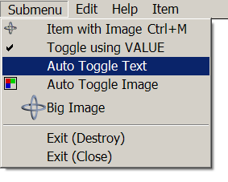
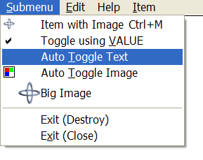
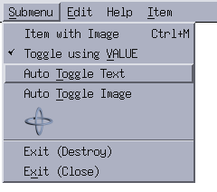
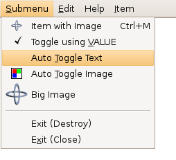
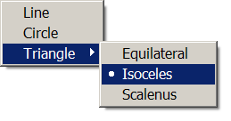
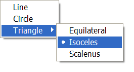
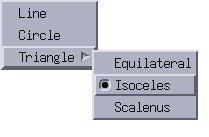
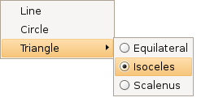

## IupMenu

Creates a menu element, which groups 3 types of interface elements: item, submenu and separator.
Any other interface element defined inside a menu will be an error.

### Creation

    Ihandle* IupMenu(Ihandle *child, ...);
    Ihandle* IupMenuV(Ihandle* child,va_list arglist);
    Ihandle* IupMenuv(Ihandle **children);

**child**, ... : List of identifiers that will be grouped by the menu.
NULL must be used to mark the end of the list in C. It can be empty.

**Returns:** the identifier of the created element, or NULL if an error occurs.

### Attributes

[BGCOLOR](../attrib/iup_bgcolor.md): the background color of the menu, affects all items in the menu.

**POPUPALIGN** (non-inheritable): alignment of the popup menu relative to the given point in the format "horiz_align:vert_align".
Where horiz_align can be: ALEFT, ACENTER or ARIGHT; and vert_align can be ATOP, ACENTER or ABOTTOM.
Default: ALEFT:ATOP.

**RADIO** (non-inheritable): enables the automatic toggle of one child item.
When a child item is selected the other item is automatically deselected.
The menu acts like a **IupRadio** for its children. Submenus and their children are not affected.

[WID](../attrib/iup_wid.md) (non-inheritable): In Windows, returns the HMENU of the menu.

### Callbacks

[OPEN_CB](../call/iup_open_cb.md): Called just before the menu is opened.

[MENUCLOSE_CB](../call/iup_menuclose_cb.md): Called just after the menu is closed.

------------------------------------------------------------------------

[MAP_CB](../call/iup_map_cb.md), [UNMAP_CB](../call/iup_unmap_cb.md), [DESTROY_CB](../call/iup_destroy_cb.md) : common callbacks are supported.

### Notes

A menu can be a menu bar of a dialog, defined by the dialog's MENU attribute, or a popup menu.

A popup menu is displayed for the user using the **IupPopup** function (usually on the mouse position) and disappears when an item is selected.

**IupDestroy** should be called only for popup menus.
Menu bars associated with dialogs are automatically destroyed when the dialog is destroyed.
But if you change the menu of a dialog for another menu, the previous one should be destroyed using **IupDestroy**.
If you replace a menu bar of a dialog, the previous menu is unmapped.

Any item inside a menu bar can retrieve attributes from the dialog using **IupGetAttribute**.
It is not necessary to call **IupGetDialog**.

The menu can be created with no elements and be dynamic filled using [IupAppend](../func/iup_append.md) or [IupInsert](../func/iup_insert.md). 

In GTK uses GtkMenuBar/GtkMenu/GtkMenu, in Windows uses CreateMenu/CreatePopupMenu/CreatePopupMenu, and in Motif uses xmRowColumn/xmPulldownMenu/xmPopupMenu, for Menu Bar/Regular Menu/Popup Menu.

### Examples

[Browse for Example Files](../../examples/)

**Windows Classic**

**Windows w/ Styles**

**Motif**

**GTK**

The **IupItem** check is affected by the RADIO attribute in **IupMenu**:

**Windows Classic**

**Windows XP Style**

**Motif**

**GTK**

### See Also

[IupDialog](../dlg/iup_dialog.md), [IupItem](iup_item.md), [IupSeparator](iup_separator.md), [IupSubmenu](iup_submenu.md), [IupPopup](../func/iup_popup.md), [IupDestroy](../func/iup_destroy.md)
