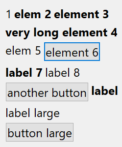
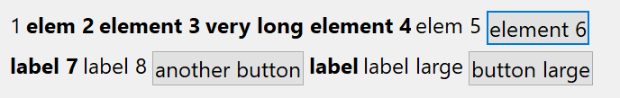

## IupMultiBox

Creates a void container for composing elements in an irregular grid.
It is a box that arranges the elements it contains from top to bottom and from left to right, by distributing the elements in lines or in columns.
But its EXPAND attribute does not behave as a regular container; instead it behaves as a regular element expanding into the available space.

The child elements are added to the control just like a vbox and hbox, sequentially.
Then they are distributed accordingly the ORIENTATION attribute.
When ORIENTATION=HORIZONTAL children are distributed from left to right on the first line until the line does not fit more elements according to the multibox current width, then on the second line, and so on.
When ORIENTATION=VERTICAL children are distributed from top to bottom on the first column until columns do not fit more elements according to the multibox current height, then on the second column, and so on.

Because of that, its elements can overlap other elements in the dialog, so the ideal combination is to put the **IupMultiBox** inside an [IupScrollBox](iup_scrollbox.md).

IMPORTANT: the actual element distribution in the container is done only after the natural size of the dialog is computed because it needs the current with or height to determine which elements will fit in the current space according to the orientation.
The first time the multibox natural size is computed, it returns simply the largest width and the highest height among the children.
The next time it will use the size previously calculated with the line/column breaks, to avoid obtaining an outdated layout call **IupRefresh** or **IupMap** before showing the dialog (when the layout will be updated again).

It does not have a native representation.

### Creation

    Ihandle* IupMultiBox(Ihandle *child, ...);
    Ihandle* IupMultiBoxV(Ihandle* child, va_list arglist);
    Ihandle* IupMultiBoxv(Ihandle **children);

**child**, ... : List of the identifiers that will be placed in the box.
NULL must be used to define the end of the list in C.
It can be empty, but in C must have at least the NULL terminator.

**Returns:** the identifier of the created element, or NULL if an error occurs.

### Attributes

**CHILDMAXSIZE** (non-inheritable): when defined limits the size of all children to a given maximum size.
Uses the format "*width*x*height*". This affects each child size.

**CHILDMINSPACE** (non-inheritable): when defined limits the space occupied by a child to a given minimum size.
Uses the format "*width*x*height*". This does not affect the children size.

[EXPAND](../attrib/iup_expand.md) (non-inheritable*): The default value is "YES".
See the documentation of the attribute for EXPAND inheritance.

**GAPVERT, CGAPVERT**: Defines a vertical space in pixels between elements, **CGAPVERT** is in the same units of the **SIZE** attribute for the height.
Default: "0".

**GAPHORIZ, CGAPHORIZ**: Defines a horizontal space in pixels between elements, **CGAP**HORIZ**** is in the same units of the **SIZE** attribute for the height.
Default: "0".

**NGAPVERT, NCGAPVERT, NGAPHORIZ, NCGAPHORIZ** (non-inheritable): Same as *GAP* but are non-inheritable.

**MARGIN, CMARGIN**: Defines a margin in pixels, **CMARGIN** is in the same units of the **SIZE** attribute.
Its value has the format "*width*x*height*", where *width* and *height* are integer values corresponding to the horizontal and vertical margins, respectively.
Default: "0x0" (no margin).

**NMARGIN, NCMARGIN** (non-inheritable): Same as **MARGIN** but are non-inheritable.

**NUMCOL** (read-only): returns the number of columns when ORIENTATION=VERTICAL.
Returns 0 otherwise.

**NUMLIN** (read-only): returns the number of lines when ORIENTATION=HORIZONTAL.
Returns 0 otherwise.

**ORIENTATION** (non-inheritable): controls the distribution of the children in lines or in columns.
Can be: HORIZONTAL or VERTICAL. Default: HORIZONTAL.

**WID** (read-only): returns -1 if mapped.

> 
>
> ------------------------------------------------------------------------

[SIZE](../attrib/iup_size.md), [RASTERSIZE](../attrib/iup_rastersize.md), [FONT](../attrib/iup_font.md), [CLIENTSIZE](../attrib/iup_clientsize.md), [CLIENTOFFSET](../attrib/iup_clientoffset.md), [POSITION](../attrib/iup_position.md), [MINSIZE](../attrib/iup_minsize.md), [MAXSIZE](../attrib/iup_maxsize.md), [THEME](../attrib/iup_theme.md): also accepted.

### Attributes (at Children)

**LINEBREAK** (non-inheritable) **(at children only)**: when defined at a child force a line break after the child when ORIENTATION=HORIZONTAL.

**COLUMNBREAK** (non-inheritable) **(at children only)**: when defined at a child force a column break after the child when ORIENTATION=VERTICAL.

### Notes

The box can be created with no elements and be dynamic filled using [IupAppend](../func/iup_append.md) or [IupInsert](../func/iup_insert.md).

The box will NOT expand its children in any condition.

The number of elements in a line when ORIENTATION=HORIZONTAL can be very different depending on the children sizes and line/column breaks.
The same for elements in a column when ORIENTATION=VERTICAL.

### Examples

[Browse for Example Files](../../examples/)

### See Also

[IupGridBox](iup_gridbox.md)[IupVbox](iup_vbox.md), [IupHbox](iup_hbox.md)
