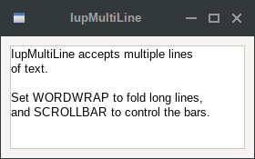
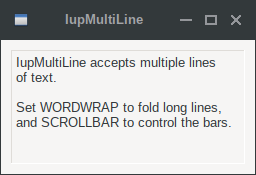
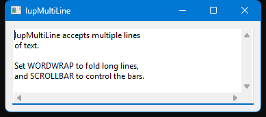
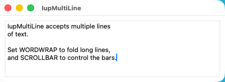

## IupMultiLine (same as IupText with MULTILINE=YES)

Creates an editable field with one or more lines.

**IupText** has support for multiple lines when the MULTILINE attribute is set to YES.
When a **IupMultiline** element is created, in fact, a **IupText** element with MULTILINE=YES is created.

See [IupText](iup_text.md)

### Creation

    Ihandle* IupMultiLine(void);

**Returns:** the identifier of the created element, or NULL if an error occurs.

### Examples

[Browse for Example Files](../../examples/)

|                                      |                                    |                                     |                                     |
|--------------------------------------|------------------------------------|-------------------------------------|-------------------------------------|
| GTK                                  | Qt                                 | Win32                               | macOS                               |
|  |  |  |  |

