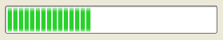
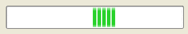
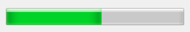
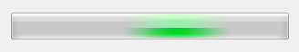
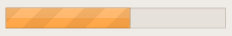
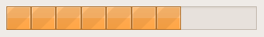
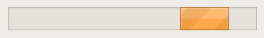

## IupProgressBar

Creates a progress bar control. Shows a percent value that can be updated to simulate a progression.

It is similar to **IupGauge**, but uses native controls internally.
Also does not have support for text inside the bar.

### Creation

    Ihandle* IupProgressBar(void);

**Returns:** the identifier of the created element, or NULL if an error occurs.

### Attributes

[BGCOLOR](../attrib/iup_bgcolor.md): controls the background color.
Default: the global attribute DLGBGCOLOR.

**DASHED** (creation-only in Windows): Changes the style of the progress bar for a dashed pattern.
Default is "NO". In Windows, it is not supported since Windows Vista when using Visual Styles.
Not supported in macOS.

[FGCOLOR](../attrib/iup_fgcolor.md): Controls the bar color.
Default: the global attribute DLGFGCOLOR.
Supported in Windows Classic, Motif and Qt.

**MARQUEE** (creation): displays an undefined state. Default: NO.
You can set the attribute after map but only to start or stop the animation.
In Windows, it will work only if using Visual Styles.

**MAX** (non-inheritable): Contains the maximum value. Default is "1".
The control display is not updated, must set VALUE attribute to update.

**MIN** (non-inheritable): Contains the minimum value. Default is "0".
The control display is not updated, must set VALUE attribute to update.

**ORIENTATION** (creation-only): can be "VERTICAL" or "HORIZONTAL". Default: "HORIZONTAL".
Horizontal goes from left to right, and vertical from bottom to top.
Not supported in WinUI.

[RASTERSIZE](../attrib/iup_rastersize.md): The initial size is defined as "200x30".
Set to NULL to allow the use of smaller values in the layout computation.

**VALUE** (non-inheritable): Contains a number between "MIN" and "MAX", controlling the current position.

> 
>
> ------------------------------------------------------------------------

[ACTIVE](../attrib/iup_active.md), [EXPAND](../attrib/iup_expand.md), [FONT](../attrib/iup_font.md), [SCREENPOSITION](../attrib/iup_screenposition.md), [POSITION](../attrib/iup_position.md), [MINSIZE](../attrib/iup_minsize.md), [MAXSIZE](../attrib/iup_maxsize.md), [WID](../attrib/iup_wid.md), [TIP](../attrib/iup_tip.md), [SIZE](../attrib/iup_size.md), [ZORDER](../attrib/iup_zorder.md), [VISIBLE](../attrib/iup_visible.md), [THEME](../attrib/iup_theme.md): also accepted. 

### Callbacks

[MAP_CB](../call/iup_map_cb.md), [UNMAP_CB](../call/iup_unmap_cb.md), [DESTROY_CB](../call/iup_destroy_cb.md): common callbacks are supported.

### Notes

In GTK uses GtkProgressBar, in Windows uses PROGRESS_CLASS, in WinUI uses XAML ProgressBar, in macOS uses NSProgressIndicator, in Qt uses QProgressBar, in EFL uses Efl_Ui_Progressbar, and in Motif uses xmScale.

### Examples

[Browse for Example Files](../../examples/)

|                   |                                                 |                                           |                                              |
|-------------------|-------------------------------------------------|-------------------------------------------|----------------------------------------------|
|                   | DASHED=NO                                       | DASHED=YES                                | MARQUEE=YES                                  |
| Motif             |    | (same as DASHED=NO)                       |    |
| Windows Classic   |  |  | (same as DASHED)                             |
| Windows w/ Styles | (same as DASHED=YES)                            |  |  |
| Windows Vista     |  | (same as DASHED=NO)                       |  |
| GTK               |    |  |    |

### See Also

[IupGauge](iup_gauge.md)
