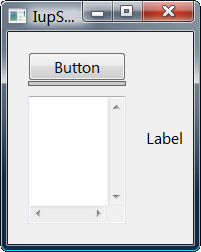
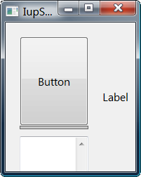
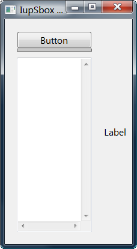
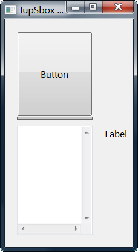

## IupSbox

Creates a void container that allows its child to be resized.
Allows expanding and contracting the child **size** in one direction.

It does not have a native representation, but it contains also a **IupFlatSeparator** to implement the bar handler.

### Creation

    Ihandle* IupSbox(Ihandle* child);

**child**: Identifier of an interface element which will receive the box. It can be NULL.

**Returns:** the identifier of the created element, or NULL if an error occurs.

### Attributes

**BARSIZE** (non-inheritable): controls the size of the bar handler. Default: 5.

**COLOR**: Changes the color of the bar handler.
Default: "160 160 160".

**DIRECTION** (creation-only): Indicates the direction of the resize and the position of the bar handler.
Possible values are "NORTH", "SOUTH" (vertical direction), "EAST" or "WEST" (horizontal direction).
Default: "EAST".

[EXPAND](../attrib/iup_expand.md) (non-inheritable): It will expand automatically only in the direction opposite to the handler. 

**LAYOUTDRAG** (non-inheritable): When the bar is moved, automatically update the children layout.
Default: YES. If set to NO then the layout will be updated only when the mouse drag is released.

**SHOWGRIP** (non-inheritable): Shows the bar grip affordance. Default: NO.
When set to NO, COLOR is used to fill the grip area.
If set to "LINES" then instead of the traditional grip appearance, it will be two parallel lines.

**WID** (read-only): returns -1 if mapped.

> 
>
> ------------------------------------------------------------------------

[FONT](../attrib/iup_font.md), [SIZE](../attrib/iup_size.md), [RASTERSIZE](../attrib/iup_rastersize.md), [CLIENTSIZE](../attrib/iup_clientsize.md), [CLIENTOFFSET](../attrib/iup_clientoffset.md), [POSITION](../attrib/iup_position.md), [MINSIZE](../attrib/iup_minsize.md), [MAXSIZE](../attrib/iup_maxsize.md), [THEME](../attrib/iup_theme.md): also accepted.

### Notes

The controls that you want to be resized must have the EXPAND=YES attribute set.
The control inside the sbox will not be resized with a size lesser than its **Natural** size.
See the [Layout Guide](../layout.md) for mode details on sizes.

The **IupFlatSeparator** bar handler is always the first child of the sbox.
It can be obtained using **IupGetChild** or **IupGetNextChild**.

**IupSbox** can make the layout to be resized larger than the dialog size, so some controls will be positioned outside the dialog area at right or bottom.
In fact this is part of the dynamic layout default reposition of controls inside the dialog.
See the **IupRefresh** function. The IUP layout does not have a maximum limit only a minimum, except if you use the MAXSIZE common attribute.

The box can be created with no elements and be dynamic filled using [IupAppend](../func/iup_append.md) or [IupInsert](../func/iup_insert.md).

### Examples

[Browse for Example Files](../../examples/)

Natural Size

After Expanding the Sbox

Expanding the Dialog

After Expanding the Sbox

