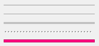

## IupSeparator

Creates an interface element that is a Separator, but it does not have native decorations.

It inherits from [IupCanvas](http://webserver2.tecgraf.puc-rio.br/iup/en/elem/iup_canvas.md).

### Creation

    Ihandle* IupSeparator();

**Returns:** the identifier of the created element, or NULL if an error occurs.

### Attributes

Inherits all attributes and callbacks of the [IupCanvas](../elem/iup_canvas.md), but redefines a few attributes.

**BARSIZE** (non-inheritable): controls the size of the separator in the opposite direction of its orientation.
Default: 5.

**COLOR** (non-inheritable): Changes the color of the separator. Default: "192 192 192".

**ORIENTATION** (non-inheritable): Indicates the orientation of the separator.
Possible values are "VERTICAL" or "HORIZONTAL". Default: "VERTICAL".

[EXPAND](../attrib/iup_expand.md) (non-inheritable): Its behavior depends on the orientation.
It will expand in the direction of the separator, but occupying only the available space.

**STYLE** (non-inheritable): The separator appearance.
Can be: "LINE", "SUNKENLINE", "DUALLINES", "GRIP", "FILL" or "EMPTY". Default: SUNKENLINE.
FILL is a rectangle filled with COLOR. EMPTY uses the parent background color only, COLOR is ignored.

> 
>
> ------------------------------------------------------------------------

[FONT](../attrib/iup_font.md), [SIZE](../attrib/iup_size.md), [RASTERSIZE](../attrib/iup_rastersize.md), [CLIENTSIZE](../attrib/iup_clientsize.md), [CLIENTOFFSET](../attrib/iup_clientoffset.md), [POSITION](../attrib/iup_position.md), [MINSIZE](../attrib/iup_minsize.md), [MAXSIZE](../attrib/iup_maxsize.md), [THEME](../attrib/iup_theme.md): also accepted.

### Callbacks

Inherits all callbacks of the [IupCanvas](../elem/iup_canvas.md), but redefines the ACTION callback.

### Notes

The **IupSeparator** is used internally in [IupSplit](iup_split.md) and in [IupSbox](iup_sbox.md).

### Examples

[Browse for Example Files](../../examples/)

Styles: LINE, SUNKENLINE, DUALLINES, GRIP, FILLCOLOR="255 0 128".

