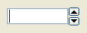

## IupSpin and IupSpinBox

This functions will create a control set with a vertical box containing two buttons, one with an up arrow and the other with a down arrow, to be used to increment and decrement values.

Unlike the SPIN attribute of the **IupText** element, the **IupSpin** element cannot automatically increment the value, and it is NOT inserted inside the **IupText** area.
But they can be used with any element.

### Creation

**IupSpin** inherits from a **IupVbox**, and contains two **IupButton**.

    Ihandle* IupSpin(void);

**Returns:** the identifier of the created element, or NULL if an error occurs.

**IupSpinbox** is an horizontal container that already contains a **IupSpin**.

    Ihandle* IupSpinbox(Ihandle* child);

**Returns:** the identifier of the created element, or NULL if an error occurs. 

**child**: Identifier of an interface element which will receive the spinbox around.

### Callbacks

**SPIN_CB**: Called each time the user clicks in the buttons. It will increment 1 and decrement -1 by default.
Holding the Shift key will set a factor of 2, holding Ctrl a factor of 10, and both a factor of 100.

int function(Ihandle *ih, int inc);

### Notes

The spinbox can be created with no elements and be dynamic filled using [IupAppend](../func/iup_append.md) or [IupInsert](../func/iup_insert.md).

### Examples

    Ihandle* spinbox = IupSpinbox(IupText(NULL));

### See Also

[IupText](iup_text.md), [IupVbox](iup_vbox.md), [IupHbox](iup_hbox.md), [IupButton](iup_button.md)
