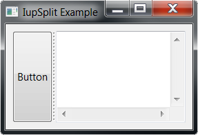
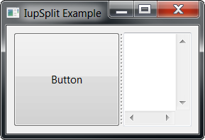

## IupSplit

Creates a void container that splits its client area in two.
It allows the provided controls to be enclosed in a box that allows expanding and contracting the element **size** in one direction, but when one is expanded the other is contracted.

It does not have a native representation, but it contains also a **IupSeparator** to implement the bar handler.

### Creation

    Ihandle* IupSplit(Ihandle* child1, Ihandle* child2);

**child1**: Identifier of an interface element that will be at left or top. It can be NULL.\
**child2**: Identifier of an interface element that will be at right or bottom. It can be NULL.

**Returns:** the identifier of the created element, or NULL if an error occurs.

### Attributes

**AUTOHIDE** (non-inheritable): if the child client area is smaller than the bar size, then automatically hide the child.
Default: NO.

**BARSIZE** (non-inheritable): controls the size of the bar handler. Default: 5.

**COLOR**: Changes the color of the bar grip affordance. Default: "160 160 160".

**ORIENTATION** (creation-only) (non-inheritable): Indicates the orientation of the bar handler.
The direction of the resize is perpendicular to the orientation. Possible values are "VERTICAL" or "HORIZONTAL".
Default: "VERTICAL".

[EXPAND](../attrib/iup_expand.md) (non-inheritable): The default value is "YES".

**LAYOUTDRAG** (non-inheritable): When the bar is moved, automatically update the children layout.
Default: YES. If set to NO then the layout will be updated only when the mouse drag is released.

**MINMAX** (non-inheritable): sets minimum and maximum crop values for VALUE, in the format "%d:%d" [min:max].
The min value cannot be less than 0, and the max value cannot be larger than 1000.
This will constrain the interactive change of the bar handler. Default: "0:1000".

**SHOWGRIP** (non-inheritable): Shows the bar grip affordance. Default: YES. When set to NO, the BARSIZE is set to 3.
When set to NO, COLOR is used to fill the grip area if defined, if COLOR is not defined the area is filled with the parent background color.
If set to "LINES" then instead of the traditional grip appearance, it will be two parallel lines.

**VALUE** (non-inheritable): The proportion of the left or top (child1) client area relative to the full available area.
It is an integer between 0 and 1000. If not defined or set to NULL, the Native size of the two children will define its initial size.

**WID** (read-only): returns -1 if mapped.

> 
>
> ------------------------------------------------------------------------

[FONT](../attrib/iup_font.md), [SIZE](../attrib/iup_size.md), [RASTERSIZE](../attrib/iup_rastersize.md), [CLIENTSIZE](../attrib/iup_clientsize.md), [CLIENTOFFSET](../attrib/iup_clientoffset.md), [POSITION](../attrib/iup_position.md), [MINSIZE](../attrib/iup_minsize.md), [MAXSIZE](../attrib/iup_maxsize.md), [THEME](../attrib/iup_theme.md): also accepted.

### Callbacks

**VALUECHANGED_CB**: Called after the value was interactively changed by the user.

    int function(Ihandle *ih);

**ih**: identifier of the element that activated the event.

### Notes

The controls that you want to be resized must have the EXPAND=YES attribute set.
See the [Layout Guide](../layout.md) for mode details on sizes.

If you set the MINMAX attribute for a direct child, **IupSplit** will respect that size.
Nested children will also have their size limits respected.

The **IupSeparator** bar handler is always the first child of the split.
It can be obtained using **IupGetChild** or **IupGetNextChild**.

The **IupSplit** control looks just like the **IupSbox**, but internally is very different.
While the **IupSbox** controls only one element and can push other elements outside the dialog, the **IupSplit** balance its internal size and never push other elements outside its boundaries.

When AUTOHIDE= Yes, the control will set FLOATING=IGNORE and VISIBLE=NO for the child to be auto-hidden, then back to FLOATING=NO and VISIBLE=Yes when shown.
So if the child has several children with different combinations of VISIBLE, it is recommended that this child be a native container like **IupBackgroundBox** or **IupFrame,** so the VISIBLE attribute will not be propagated to its children.

The container can be created with no elements and be dynamic filled using [IupAppend](../func/iup_append.md) or [IupInsert](../func/iup_insert.md).

### Examples

[Browse for Example Files](../../examples/)

Natural Size

After Moving the Split Bar

