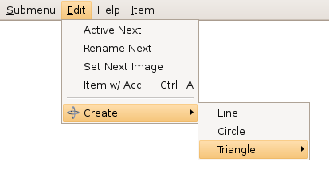

## IupSubmenu

Creates a menu item that, when selected, opens another menu.

### Creation

    Ihandle* IupSubmenu(const char *title, Ihandle *menu);

**title**: String containing the text to be shown on the item. It can be NULL.
It will set the TITLE attribute.\
**menu**: optional child menu identifier. It can be NULL.

**Returns:** the identifier of the created element, or NULL if an error occurs.

### Attributes

**IMAGE** (non-inheritable): Image name of the submenu image.
In Windows, an item in a menu bar cannot have a check mark. Ignored if submenu in a menu bar.
A recommended size would be 16x16 to fit the image in the menu item.
In Windows, if larger than the check mark area it will be cropped.

[KEY](../attrib/iup_key.md) (non-inheritable): Underlines a key character in the submenu title.
It is updated only when TITLE is updated.  Deprecated**, use the mnemonic support directly in the TITLE attribute.**

[TITLE](../attrib/iup_title.md) (non-inheritable): Submenu Text.
The "&" character can be used to define a mnemonic, the next character will be used as a key.
Use "&&" to show the "&" character instead on defining a mnemonic.

[WID](../attrib/iup_wid.md) (non-inheritable): In Windows, returns the HMENU of the parent menu, and it is actually created only when its child menu is mapped.

> 
>
> ------------------------------------------------------------------------

[ACTIVE](../attrib/iup_active.md), [THEME](../attrib/iup_theme.md): also accepted.

### Callbacks

[HIGHLIGHT_CB](../call/iup_highlight_cb.md): Action generated when the submenu is highlighted.

------------------------------------------------------------------------

[MAP_CB](../call/iup_map_cb.md), [UNMAP_CB](../call/iup_unmap_cb.md), [DESTROY_CB](../call/iup_destroy_cb.md): common callbacks are supported.

### Notes

In Motif and GTK, the text font will be affected by the dialog font when the menu is mapped.

In GTK uses GtkMenuItem, in GTK 4 uses GMenu submenu, in Windows uses InsertMenuItem, in WinUI uses XAML MenuFlyoutSubItem, in macOS uses NSMenuItem with submenu, in Qt uses QMenu (as action), in EFL uses Elm_Menu_Item with submenu, and in Motif uses xmCascadeButton.

### Examples

[Browse for Example Files](../../examples/)

See the **IupMenu** element for more screenshots.

### See Also

[IupMenuItem](iup_menuitem.md), [IupMenuSeparator](iup_menuseparator.md), [IupMenu](iup_menu.md).
