## IupTabs

Creates a native container for composing elements in hidden layers with only one layer visible (just like **[IupZbox](iup_zbox.md)**), but its visibility can be interactively controlled.
The interaction is done in a line of tabs with titles and arranged according to the tab type.
Also known as Notebook in native systems.

### Creation

    Ihandle* IupTabs(Ihandle* child, ...);
    Ihandle* IupTabsV(Ihandle* child, va_list arglist);
    Ihandle* IupTabsv(Ihandle** children);

**child, ...** : List of the elements that will be placed in the box.
NULL must be used to define the end of the list in C.
It can be empty, but in C must have at least the NULL terminator.

**Returns:** the identifier of the created element, or NULL if an error occurs.

### Attributes

[BGCOLOR](../attrib/iup_bgcolor.md): In Windows and in GTK when in Windows, the tab buttons background it will always be defined by the system.
In Windows the default background is different from the dialog background.
Default: the global attribute DLGBGCOLOR.

**CHILDOFFSET**: Allow specifying a position offset for the child. Available for native containers only.
It will not affect the natural size, and allows to position controls outside the client area.
Format "*dx*x*dy*", where *dx* and *dy* are integer values corresponding to the horizontal and vertical offsets, respectively, in pixels.
Default: 0x0.

**CHILDSIZEALL** (non-inheritable): compute the natural size using all children.
If set to NO will compute using only the current tab. Default: Yes.

**COUNT** (read-only) (non-inheritable)**:** returns the number of tabs.
Same value returned by **IupGetChildCount**.

[EXPAND](../attrib/iup_expand.md) (non-inheritable): The default value is "YES".

[FGCOLOR](../attrib/iup_fgcolor.md): Tabs title color. Default: the global attribute DLGFGCOLOR.

**ALLOWREORDER** (non-inheritable): enables the user to reorder tabs by dragging them.
Can be "YES" or "NO". Default: "NO".
Not supported in Motif.

**MULTILINE** [Windows and Qt Only] (non-inheritable): Enable multiple lines of tab buttons.
This will hide the tab scroll and fits to make all tab buttons visible. Can be "YES" or "NO".
Default "NO". It is always enabled when TABTYPE=LEFT or TABTYPE=RIGHT.

**SHOWCLOSE** (non-inheritable): enables the close button on each tab.
Default value: "NO". In Windows the close button implies the classic visual for the control.
By default, when closed the tab is hidden.
To change that behavior, use the TABCLOSE_CB callback.

[SIZE](../attrib/iup_size.md) (non-inheritable): The default size is the smallest size that fits its largest child.
All child elements are considered even invisible ones.

**TABORIENTATION** (non-inheritable): Indicates the orientation of tab text, which can be "HORIZONTAL" or "VERTICAL".
Default is "HORIZONTAL". VERTICAL is supported only in GTK and in Windows.
In Windows, it cannot be set, it is dependent on the TABTYPE attribute, if TABTYPE=LEFT or TABTYPE=RIGHT then TABORIENTATION=VERTICAL, if TABTYPE=TOP or TABTYPE=BOTTOM then TABORIENTATION=HORIZONTAL.
Not supported in WinUI.

**TABPADDING** (non-inheritable): internal margin of the tab title.
Works just like the MARGIN attribute of the IupHbox and IupVbox containers, but uses a different name to avoid inheritance problems.
Default value: "0x0".

**TABTYPE** (non-inheritable) (creation-only in Windows): Indicates the type of tab, which can be "TOP", "BOTTOM", "LEFT" or "RIGHT".
Default is "TOP". In Windows, if LEFT or RIGHT then MULTILINE=YES and TABORIENTATION**=**VERTICAL are set, if TOP or BOTTOM then TABORIENTATION**=**HORIZONTAL is set.
In Windows, when not TOP, then visual style is removed from tabs.

#### Tab Attributes

**TABIMAGEn** (non-inheritable): image name to be used in the respective tab.
Use [IupSetHandle](../func/iup_sethandle.md) or [IupSetAttributeHandle](../func/iup_setattributehandle.md) to associate an image to a name. n starts at 0.
See also [IupImage](iup_image.md). In Motif, the image is shown only if **TABTITLEn** is NULL.
In Windows and Motif set the BGCOLOR attribute before setting the image.
When set after map will update the TABIMAGE attribute on the respective child.

**TABVISIBLEn** (non-inheritable): Allows to hide a tab. n starts at 0.
When a tab is hidden the tabs indices are not changed. Can be Yes or No. Default: Yes.

**TABTITLEn** (non-inheritable): Contains the text to be shown in the respective tab title. n starts at 0.
If this value is NULL, it will remain empty.
The "&" character can be used to define a mnemonic, the next character will be used as a key.
Use "&&" to show the "&" character instead on defining a mnemonic.
The button can be activated from any control in the dialog using the "Alt+key" combination.
When set after map it will update the TABTITLE attribute on the respective child.

#### Current Tab

**VALUE** (non-inheritable): Changes the current tab by its name.
The value passed must be the name of one of the elements contained in the tabs.
Use [IupSetHandle](../func/iup_sethandle.md) or [IupSetAttributeHandle](../func/iup_setattributehandle.md) to associate a child to a name.

**VALUE_HANDLE** (non-inheritable): Changes the current tab by its handle.
The value passed must be the handle of a child contained in the tabs.
When the tabs are created, the first element inserted is set as the visible child.

**VALUEPOS** (non-inheritable): Changes the current tab by its position, starting at 0.
When the tabs are created, the first element inserted is set as the visible child.
In GTK, inside the callback the returned value is still the previous one.

> 
>
> ------------------------------------------------------------------------

[ACTIVE](../attrib/iup_active.md), [FONT](../attrib/iup_font.md), [SCREENPOSITION](../attrib/iup_screenposition.md), [POSITION](../attrib/iup_position.md), [CLIENTSIZE](../attrib/iup_clientsize.md), [CLIENTOFFSET](../attrib/iup_clientoffset.md), [MINSIZE](../attrib/iup_minsize.md), [MAXSIZE](../attrib/iup_maxsize.md), [WID](../attrib/iup_wid.md), [TIP](../attrib/iup_tip.md), [RASTERSIZE](../attrib/iup_rastersize.md), [ZORDER](../attrib/iup_zorder.md), [VISIBLE](../attrib/iup_visible.md), [THEME](../attrib/iup_theme.md): also accepted.

### Attributes (at Children)

[FLOATING](../attrib/iup_floating.md) (non-inheritable) **(at children only)**: If a child has FLOATING=YES then its size and position will be ignored by the layout processing.
Default: "NO".

**TABTITLE** (non-inheritable) **(at children only)**: Same as **TABTITLEn** but set in each child.
Works only if set before the child is added to the tabs.

**TABIMAGE** (non-inheritable) **(at children only)**: Same as **TABIMAGEn** but set in each child.
Works only if set before the child is added to the tabs.

### Callbacks

**TABCHANGE_CB**: Callback called when the user changes the current tab.
It is not called when the current tab is programmatically changed or removed.

int function(Ihandle* ih, Ihandle* new_tab, Ihandle* old_tab);

**ih**: identifier of the element that activated the event.\
**new_tab**: the new tab selected by the user\
**old_tab**: the previously selected tab

**TABCHANGEPOS_CB**: Callback called when the user changes the current tab.
Called only when TABCHANGE_CB is not defined.

int function(Ihandle* ih, int new_pos, int old_pos);

**ih**: identifier of the element that activated the event.\
**new_pos**: the new tab position selected by the user\
**old_pos**: the previously selected tab position

**TABCLOSE_CB**: Callback called when the user clicks on the close button.
Called only when SHOWCLOSE=Yes.

int function(Ihandle* ih, int pos);

**ih**: identifier of the element that activated the event.\
**pos**: the tab position

**Returns**: the tab will be hidden if the callback returns IUP_DEFAULT or if it does not exists.
If IUP_CONTINUE is returned the tab is removed and its children are destroyed.
If IUP_IGNORE is returned does nothing.

**FOCUS_CB**: Called when a child of the container gets or loses the focus.
It is called only if PROPAGATEFOCUS is defined in the child.

    int function(Ihandle *ih, int focus);

**ih**: identifier of the element that activated the event.\
**focus**: is non-zero if the canvas is getting the focus, is zero if it is losing the focus.

**RIGHTCLICK_CB**: Callback called when the user clicks on some tab using the right mouse button.

int function(Ihandle* ih, int pos);

**ih**: identifier of the element that activated the event.\
**pos**: the tab position

**REORDER_CB**: Callback called when the user reorders a tab by dragging it to a new position.
Called only when ALLOWREORDER=Yes. Not supported in Motif.

int function(Ihandle* ih, int old_pos, int new_pos);

**ih**: identifier of the element that activated the event.\
**old_pos**: the original tab position before the reorder.\
**new_pos**: the new tab position after the reorder.

**Returns**: if IUP_IGNORE is returned the reorder is rejected and the tab returns to its original position.

>
>
> ------------------------------------------------------------------------

[MAP_CB](../call/iup_map_cb.md), [UNMAP_CB](../call/iup_unmap_cb.md), [DESTROY_CB](../call/iup_destroy_cb.md), [GETFOCUS_CB](../call/iup_getfocus_cb.md), [KILLFOCUS_CB](../call/iup_killfocus_cb.md), [ENTERWINDOW_CB](../call/iup_enterwindow_cb.md), [LEAVEWINDOW_CB](../call/iup_leavewindow_cb.md), [K_ANY](../call/iup_k_any.md), [HELP_CB](../call/iup_help_cb.md): All common callbacks are supported.

### Notes

The Tabs can be created with no children and be dynamic filled using [IupAppend](../func/iup_append.md).

The ENTERWINDOW_CB and LEAVEWINDOW_CB callbacks are called only when the mouse enters or leaves the tabs buttons area.

Its children automatically receive a name when the child is appended or inserted into the tabs.

Differently from **IupZbox**, **IupTabs** does NOT depends on the VISIBLE attribute.

In GTK, when the tabs buttons are scrolled, the current tab is also changed.

When you change the current tab, the focus is usually not changed.
If you want to control the focus behavior, call **IupSetFocus** in the TABCHANGE_CB callback.
Unfortunately, this does not work in GTK and in Motif, because in both systems the focus will be set by the system after the callback is called.

Notice that there is no attribute to disable a single tab.
This is a design decision of all native toolkits, not an IUP decision.
It is so because a disabled tab is a confusing interface situation.

In Windows, when an **IupVal** is inside an **IupTabs**, the tabs disappear when the mouse moves over it after being used in the valuator.
A workaround is to put the valuator inside an **IupFrame** and then inside the **IupTabs**, so the problem does not occur.

In GTK uses GtkNotebook, in Windows uses WC_TABCONTROL, in WinUI uses XAML TabView, in macOS uses a custom NSView, in Qt uses QTabWidget, in EFL uses a custom tab control, and in Motif uses xmNotebook.

### Utility Functions

These functions can be used to set and get attributes from the element:

    void  IupSetAttributeId(Ihandle *ih, const char* name, int id, const char* value);
    char* IupGetAttributeId(Ihandle *ih, const char* name, int id);
    int   IupGetIntId(Ihandle *ih, const char* name, int id);
    float IupGetFloatId(Ihandle *ih, const char* name, int id);
    void  IupSetfAttributeId(Ihandle ih, const char* name, int id, const char* format, ...);
    void  IupSetIntId(Ihandle* ih, const char* name, int id, int value);
    void  IupSetFloatId(Ihandle* ih, const char* name, int id, float value);

They work just like the respective traditional set and get functions.
But the attribute string is complemented with the id value. For ex:

    IupSetAttributeId(ih, "TABTITLE", 3, value) == IupSetAttribute(ih, "TABTITLE3", value)

But these functions are faster than the traditional functions because they do not need to parse the attribute name string and the application does not need to concatenate the attribute name with the id.

### Examples

[Browse for Example Files](../../examples/)

In Windows, the Visual Styles work only when TABTYPE is TOP.

**Windows Classic**
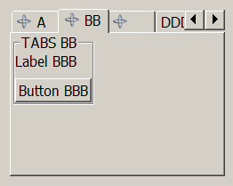
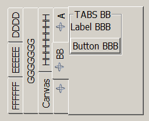
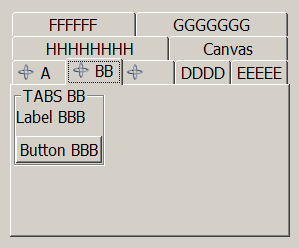

**Windows w/ Styles**
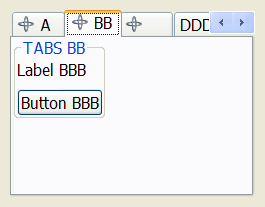
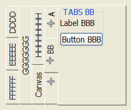
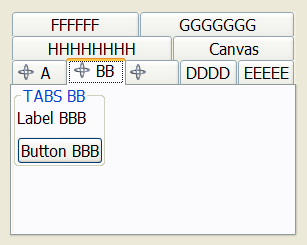

GTK is the only one that supports vertical text in the TOP configuration, but does not supports multiple lines of tab buttons.

**GTK**
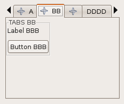
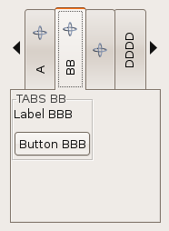
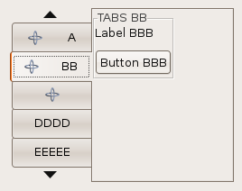
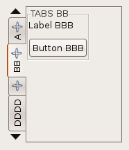

Motif does not supports vertical text.

**Motif**
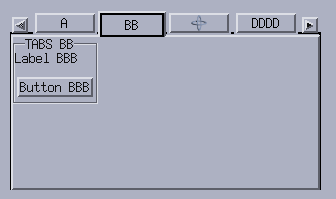
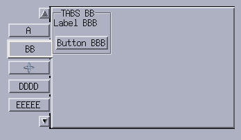

### See Also

[IupFlatTabs](iup_flattabs.md), [IupZbox](iup_zbox.md)
