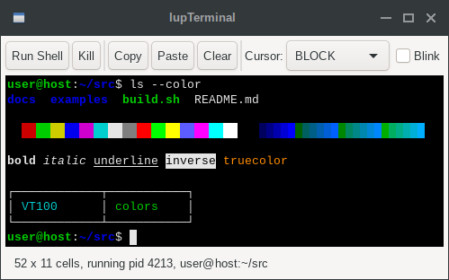

## IupTerminal

Creates a terminal emulator control.
It inherits from [IupCanvas](../elem/iup_canvas.md).

The control implements a VT100/xterm compatible screen: UTF-8 text, ANSI colors (16, 256 and
truecolor), text attributes, scroll regions, alternate screen, scrollback history and
keyboard input encoding. Applications feed output bytes through WRITE and receive encoded
user input through INPUT_CB. The terminal identifies itself as **xterm-256color**.

EXEC runs a command on a pseudo-terminal instead. The control then writes the command output
to the screen and sends user input to the command, and INPUT_CB is not called.

### Creation

    Ihandle* IupTerminal(void);

**Returns:** the identifier of the created element, or NULL if an error occurs.

### Attributes

**WRITE** (write-only) (non-inheritable): feeds bytes to the terminal. The value is processed
by the escape sequence parser and displayed. Cannot contain embedded NUL bytes.

**APPEND** (write-only) (non-inheritable): same as WRITE, appending "\r\n" after the value.

**COLUMNS** (read-only) (non-inheritable): current number of character columns.

**LINES** (read-only) (non-inheritable): current number of character lines.

**VISIBLECOLUMNS** (non-inheritable): number of columns used to compute the natural size.
Default: "80".

**VISIBLELINES** (non-inheritable): number of lines used to compute the natural size.
Default: "24".

**SCROLLBACKLINES** (non-inheritable): maximum number of history lines kept off screen.
Setting it discards the existing history. "0" disables scrollback. Default: "5000".

**CURSORSTYLE** (non-inheritable): cursor shape. Can be "BLOCK", "BAR" or "UNDERLINE".
Also changed by the DECSCUSR escape sequence. Default: "BLOCK".

**CURSORBLINK** (non-inheritable): cursor blinking. Can be YES or NO. Also changed by DEC
private mode 12. Default: NO.

**SCROLLONOUTPUT** (non-inheritable): scroll to the bottom when output arrives while the view
is in the history. Can be YES or NO. Default: YES.

**SCROLLONKEY** (non-inheritable): scroll to the bottom on key input while the view is in the
history. Can be YES or NO. Default: YES.

**OPTIONASMETA** (non-inheritable): send Option as Meta, so Option+X produces ESC followed by X
instead of the character the keyboard layout composes. Can be YES or NO. Default: NO.
Only affects macOS; the other drivers already report the key as Alt. While YES, Option no longer
composes accented characters or dead keys.

**COLOR0** ... **COLOR15** (non-inheritable): the 16 base palette colors, in "R G B" format.
Defaults are the xterm palette. Also changed by the OSC 4 escape sequence.

[FGCOLOR](../attrib/iup_fgcolor.md): default text color. Default: "229 229 229".

[BGCOLOR](../attrib/iup_bgcolor.md): default background color. Default: "0 0 0".

[FONT](../attrib/iup_font.md): must be a monospaced font. Default: "Courier, 10". When the
configured font is not monospaced the control substitutes a monospaced family.
Changing it, or FONTFACE, FONTSIZE and FONTSTYLE, recomputes the number of columns and lines for
the same control size and generates TERMSIZE_CB. Bold and italic text is drawn with the
corresponding style of the same font.

**SELECTEDTEXT** (non-inheritable): the currently selected text, in UTF-8, or NULL when there is
no selection. Lines are separated by "\n"; a line wrapped by the terminal is joined without a
separator. Set to NULL to clear the selection.

**AUTOCOPY** (non-inheritable): copy the selection to the clipboard when the mouse button is
released. Can be YES or NO. Default: NO.

**COPYSELECTION** (write-only) (non-inheritable): copy the selection to the clipboard.

**PASTE** (write-only) (non-inheritable): send text to the application as if it were typed. If the
value is NULL the clipboard text is used. When the application enabled bracketed paste the text is
wrapped in the paste markers.

**SELECTALL** (write-only) (non-inheritable): select the whole buffer, including the history.

**RESET** (write-only) (non-inheritable): fully resets the terminal and clears the history.

**CLEARSCREEN** (write-only) (non-inheritable): clears the visible screen.

**TERMNAME** (non-inheritable): terminal type name, used as TERM for the EXEC command.
Default: "xterm-256color".

**EXEC** (write-only) (non-inheritable): starts a command on a pseudo-terminal and connects it
to the terminal. The value is the command line, split on spaces, with double quotes grouping an
argument that contains spaces. When NULL or empty it runs the SHELL environment variable, or "/bin/sh" ("/system/bin/sh" in
Android, the COMSPEC environment variable in Windows). Setting it again terminates the previous
command. The command starts when the control is mapped, so it can be set before the dialog is
shown. On failure PTYERROR is set. Use KILL to terminate the command.
Not supported in iOS and WebAssembly.

**KILL** (write-only) (non-inheritable): terminates the EXEC command. "FORCE" kills it
immediately, any other value requests a hang up.

**PTYPID** (read-only) (non-inheritable): process identifier of the EXEC command, or -1 when
no command is running.

**PTYERROR** (read-only) (non-inheritable): description of the last EXEC failure, or NULL.

**PTYSUPPORT** (read-only) (non-inheritable): "YES" when the platform can run EXEC. In Windows
it is "NO" before Windows 10 version 1809.

[EXPAND](../attrib/iup_expand.md): the default is "YES".

> 
>
> ------------------------------------------------------------------------

[ACTIVE](../attrib/iup_active.md), [SCREENPOSITION](../attrib/iup_screenposition.md), [POSITION](../attrib/iup_position.md), [MINSIZE](../attrib/iup_minsize.md), [MAXSIZE](../attrib/iup_maxsize.md), [WID](../attrib/iup_wid.md), [TIP](../attrib/iup_tip.md), [RASTERSIZE](../attrib/iup_rastersize.md), [ZORDER](../attrib/iup_zorder.md), [VISIBLE](../attrib/iup_visible.md), [THEME](../attrib/iup_theme.md): also accepted.

### Callbacks

**INPUT_CB**: action generated when the user types in the terminal or the terminal answers a
query from the application. The bytes are encoded in xterm keyboard format.

    int function(Ihandle *ih, char *bytes, int len);

**ih**: identifier of the element that activated the event.\
**bytes**: encoded input bytes. Not NUL terminated.\
**len**: number of bytes.

**TITLE_CB**: action generated when the application sets the window title (OSC 0 or OSC 2).

    int function(Ihandle *ih, char *title);

**ih**: identifier of the element that activated the event.\
**title**: the requested window title.

**BELL_CB**: action generated by the BEL character.

    int function(Ihandle *ih);

**ih**: identifier of the element that activated the event.

**TERMSIZE_CB**: action generated when the terminal grid is resized.

    int function(Ihandle *ih, int columns, int lines);

**ih**: identifier of the element that activated the event.\
**columns, lines**: new size of the grid in cells.

**EXIT_CB**: action generated when the EXEC command terminates.

    int function(Ihandle *ih, int status);

**ih**: identifier of the element that activated the event.\
**status**: exit code of the command, or 128 plus the signal number when it was terminated by
a signal.

> 
>
> ------------------------------------------------------------------------

[MAP_CB](../call/iup_map_cb.md), [UNMAP_CB](../call/iup_unmap_cb.md), [DESTROY_CB](../call/iup_destroy_cb.md), [GETFOCUS_CB](../call/iup_getfocus_cb.md), [KILLFOCUS_CB](../call/iup_killfocus_cb.md), [ENTERWINDOW_CB](../call/iup_enterwindow_cb.md), [LEAVEWINDOW_CB](../call/iup_leavewindow_cb.md): common callbacks are supported.

### Notes

Supported escape sequences: cursor movement (CUU, CUD, CUF, CUB, CNL, CPL, CHA, CUP, HPA,
VPA, HPR, VPR), erase (ED, EL, ECH), editing (ICH, DCH, IL, DL, REP), scrolling (SU, SD,
DECSTBM), tabs (HTS, TBC, CHT, CBT), SGR text attributes with 16/256/truecolor, save/restore
cursor (DECSC, DECRC, SCOSC, SCORC), DEC private modes 1, 6, 7, 12, 25, 47, 1047, 1048, 1049,
1000, 1002, 1006, 2004, cursor style (DECSCUSR), DEC Special Graphics charset, OSC 0/2 title,
OSC 4 palette, OSC 10/11 default colors, OSC 104 palette reset, and the reports DSR, CPR,
DA1 and XTWINOPS 18. Unknown sequences are consumed and ignored.

Tab is consumed by the terminal and sent to the application; it does not move the focus to
the next control.

The scrollbar and the mouse wheel navigate the history. The view snaps to the bottom on new output
or key input (see SCROLLONOUTPUT and SCROLLONKEY). The alternate screen has no history, so there
the wheel is translated to cursor keys.

Selection: drag with the left button selects characters, a double click selects a word, a second
double click on the same word selects the line, and Shift with the left button extends the current
selection. The middle button pastes. Ctrl+Shift+C copies and Ctrl+Shift+V pastes.

When the application enables mouse reporting the mouse belongs to the application and the terminal
stops selecting. Hold Shift to select anyway.

The EXEC command is terminated when the control is destroyed. Resizing the control resizes the
pseudo-terminal and the command receives SIGWINCH.

### Examples

[Browse for Example Files](../../examples/)

    Ihandle* term = IupTerminal();
    IupSetAttribute(term, "WRITE", "\033[1;32mhello\033[0m world\r\n");

Running a shell:

    Ihandle* term = IupTerminal();
    IupSetAttribute(term, "EXEC", "/bin/bash -l");
