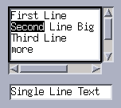
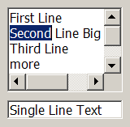
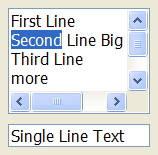
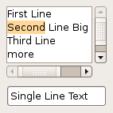
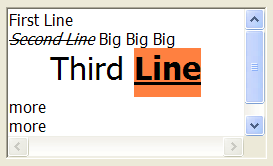
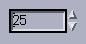
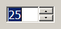
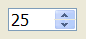
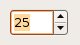

## IupText

Creates an editable text field.

### Creation

    Ihandle* IupText(const char *action);

**action**: name of the action generated when the user types something. It can be NULL.

**Returns:** the identifier of the created element, or NULL if an error occurs.

### Attributes

**ALIGNMENT** [Windows and GTK Only] (non-inheritable): horizontal text alignment.
Possible values: "ALEFT", "ARIGHT", "ACENTER". Default: "ALEFT".
In Motif, text is always left aligned.

**APPEND** (write-only): Inserts a text at the end of the current text.
In the Multiline, if APPENDNEWLINE=YES, a "\n" character is automatically inserted before the appended text if the current text is not empty(APPENDNEWLINE default is YES).
Ignored if set before map.

[BGCOLOR](../attrib/iup_bgcolor.md): Background color of the text. Default: the global attribute TXTBGCOLOR.
Ignored in GTK when MULTILINE=NO.

**BORDER** (creation-only): Shows a border around the text. Default: "YES".

**CANFOCUS** (creation-only) (non-inheritable): enables the focus traversal of the control.
In Windows the control will still get the focus when clicked. Default: YES.

**PROPAGATEFOCUS**(non-inheritable): enables the focus callback forwarding to the next native parent with FOCUS_CB defined.
Default: NO.

**CARET** (non-inheritable): **Character** position of the insertion point. Its format depends in MULTILINE=YES.
The first position, **lin** or **col**, is "1".

**For multiple lines**: a string with the "**lin**,**col**" format, where **lin** and **col** are integer numbers corresponding to the caret's position.

**For single line**: a string in the "**col**" format, where **col** is an integer number corresponding to the caret's position.

When **lin** is greater than the number of lines, the caret is placed at the last line.
When **col** is greater than the number of characters in the given line, the caret is placed after the last character of the line.

If the caret is not visible the text is scrolled to make it visible.

In Windows, if the element does not have the focus, the returned value is the position of the first character of the current selection.
The caret is only displayed if the element has the keyboard focus, but its position can be changed even if not visible.
When changed, it will also change the selection, but the text will be scrolled only when it receives the focus.

See the Notes below if using UTF-8 strings in GTK.

**CARETPOS** (non-inheritable): Also the **character** position of the insertion point, but using a zero based character unique index "pos".
Useful for indexing the VALUE string. See the Notes below if using UTF-8 strings in GTK.

**CHANGECASE** (non-inheritable): Change case according to given conversion. Can be UPPER, LOWER, TOGGLE, or TITLE.
TITLE case change first letter of words separated by spaces to upper case others to lower case, but the first letter is changed only if word has more than 3 characters, for instance: "Best of the World".
Supports Latin-1 encoding only, even when using UTF-8.
Does not depend on current locale.

**CLIPBOARD** (write-only): clear, cut, copy or paste the selection to or from the clipboard.
Values: "CLEAR", "CUT", "COPY" or "PASTE".
In Windows UNDO is also available, and REDO is available when FORMATTING=YES.

**COUNT** (read-only): returns the number of **characters** in the text, including the line breaks.

**CUEBANNER** [Windows and GTK Only] (non-inheritable): a text that is displayed when there is no text at the control.
It works as a textual cue, or tip to prompt the user for input.
Valid only for MULTILINE=NO, and works only when Visual Styles are enabled. [GTK 3.2]

**DROPFILESTARGET** [Windows and GTK Only] (non-inheritable): Enable or disable the drop of files.
Default: NO, but if DROPFILES_CB is defined when the element is mapped then it will be automatically enabled.

[FGCOLOR](../attrib/iup_fgcolor.md): Text color. Default: the global attribute TXTFGCOLOR.

**FILTER** [Windows Only] (non-inheritable): allows a custom filter to process the characters: Can be LOWERCASE, UPPERCASE or NUMBER (only numbers allowed).

[FORMATTING](../attrib/iup_formatting.md) [Windows and GTK Only] (non-inheritable): When enabled allows the use of text formatting attributes.
In GTK is always enabled, but only when MULTILINE=YES. Default: NO.

**INSERT** (write-only): Inserts a text in the caret's position, also replaces the current selection if any.
Ignored if set before map.

**LINECOUNT** (read-only): returns the number of lines in the text.
When MULTILINE=NO returns always "1".

**LINEVALUE** (read-only): returns the text of the line where the caret is. It does not include the "\n" character.
When MULTILINE=NO returns the same as VALUE.

**LOADRTF** (write-only) [Windows Only]: loads formatted text from a Rich Text Format file given its filename.
The attribute LOADRTFSTATUS is set to OK or FAILED after the file is loaded.

**SAVERTF** (write-only) [Windows Only]: saves formatted text to a Rich Text Format file given its filename.  The attribute SAVERTFSTATUS is set to OK or FAILED after the file is saved.

[MASK](../attrib/iup_mask.md) (non-inheritable): Defines a mask that will filter interactive text input.

**MULTILINE** (creation-only) (non-inheritable): allows the edition of multiple lines.
In single line mode some characters are invalid, like "\t", "\r" and "\n". Default: NO.
When set to Yes will also reset the SCROLLBAR attribute to Yes.

**NC**: Maximum number of **characters** allowed for keyboard input, a larger text can still be set using attributes.
The maximum value is the limit of the VALUE attribute. The "0" value is the same as maximum.
Default: maximum.

**NOHIDESEL** [Windows Only]: do not hide the selection when the control loses its focus.
Default: Yes.

**OVERWRITE** [Windows and GTK Only] (non-inheritable): turns the overwrite mode ON or OFF.
Works only when FORMATTING=YES.

**PADDING**: internal margin. Works just like the MARGIN attribute of the **IupHbox** and **IupVbox** containers, but uses a different name to avoid inheritance problems.
Default value: "0x0". In Windows, only the horizontal value is used. (GTK 2.10 for single line)

**CPADDING**: same as PADDING but using the units of the **SIZE** attribute.
It will actually set the PADDING attribute.

**PASSWORD** (creation-only) [Windows and GTK Only] (non-inheritable): Hide the typed character using an "*".
Default: "NO".

**READONLY**: Allows the user only to read the contents, without changing it.
Restricts keyboard input only, text value can still be changed using attributes.
Navigation keys are still available. Possible values: "YES", "NO". Default: NO.

**SCROLLBAR** (creation-only): Valid only when MULTILINE=YES.
Associates an automatic horizontal and/or vertical scrollbar to the multiline.
Can be: "VERTICAL", "HORIZONTAL", "YES" (both) or "NO" (none). Default: "YES".
For all systems, when SCROLLBAR!=NO the natural size will always include its size even if the native system hides the scrollbar.
If **AUTOHIDE**=YES scrollbars are visible only if they are necessary, by default AUTOHIDE=NO.
In Windows when FORMATTING=NO, AUTOHIDE is not supported. In Motif AUTOHIDE is not supported.

**SCROLLTO** (non-inheritable, write-only): Scroll the text to make the given **character** position visible.
It uses the same format and reference of the CARET attribute ("lin:col" or "col" starting at 1).
In Windows, when FORMATTING=Yes "col" is ignored.

**SCROLLTOPOS** (non-inheritable, write-only): Scroll the text to make the given **character** position visible.
It uses the same format and reference of the CARETPOS attribute ("pos" starting at 0).

**SCROLLVISIBLE** (read-only) [Windows Only]: Returns which scrollbars are visible at the moment.
Can be: YES (both), VERTICAL, HORIZONTAL, NO.

**SELECTEDTEXT** (non-inheritable): Selection text. Returns NULL if there is no selection.
When changed replaces the current selection.
Similar to INSERT, but does nothing if there is no selection.

**SELECTION** (non-inheritable): Selection interval in **characters**. Returns NULL if there is no selection.
Its format depends on MULTILINE=YES. The first position, **lin** or **col**, is "1".

**For multiple lines**: a string in the "**lin1**,**col1**:**lin2**,**col2**" format, where **lin1**, **col1**, **lin2** and **col2** are integer numbers corresponding to the selection's interval.
**col2** correspond to the character after the last selected character.

**For single line**: a string in the "**col1**:**col2**" format, where **col1** and **col2** are integer numbers corresponding to the selection's interval.
**col2** correspond to the character after the last selected character.

In Windows, when changing the selection, the caret position is also changed.

The values ALL and NONE are also accepted independently of MULTILINE.

See the Notes below if using UTF-8 strings in GTK.

**SELECTIONPOS** (non-inheritable): Same as SELECTION but using a zero-based **character** index "**pos1**:**pos2**".
Useful for indexing the VALUE string. The values ALL and NONE are also accepted.
See the Notes below if using UTF-8 strings in GTK.

[SIZE](../attrib/iup_size.md) (non-inheritable): Since the contents can be changed by the user, the **Natural Size** is not affected by the text contents.
Use VISIBLECOLUMNS and VISIBLELINES to control the **Natural Size**.

**SPIN** (non-inheritable, creation-only): enables a spin control attached to the element.
Default: NO. The spin increments and decrements an integer number.
The editing in the element is still available.

**SPINVALUE** (non-inheritable): the current value of the spin.
The value is limited to the minimum and maximum values.\
**SPINMAX** (non-inheritable): the maximum value. Default: 100.\
**SPINMIN** (non-inheritable): the minimum value. Default: 0.\
**SPININC** (non-inheritable): the increment value. Default: 1.\
**SPINALIGN** (creation-only): the position of the spin. Can be LEFT or RIGHT. Default: RIGHT.
In GTK is always RIGHT.\
**SPINWRAP** (creation-only): if the position reaches a limit, it continues from the opposite limit.
Default: NO.\
**SPINAUTO** (creation-only): enables the automatic update of the text contents.
Default: YES. Use SPINAUTO=NO and the VALUE attribute during SPIN_CB to control the text contents when the spin is incremented.

In Windows, the increment is multiplied by 5 after 2 seconds and multiplied by 20 after 5 seconds of a spin button pressed.
In GTK, the increment change is progressively accelerated when a spin button is pressed.

**TABSIZE** [Windows and GTK Only]: Valid only when MULTILINE=YES. Controls the number of characters for a tab stop.
Default: 8.

**VALUE** (non-inheritable): Text entered by the user.
The '\n' character indicates a new line, valid only when MULTILINE=YES.
After the element is mapped and if there is no text will return the empty string "".

**VALUEMASKED** (non-inheritable) (write-only): sets VALUE but first checks if it is validated by MASK.
If not, does nothing.

**VISIBLECOLUMNS**: Defines the number of visible columns for the **Natural Size**, this means that will act also as minimum number of visible columns.
It uses a wider character size than the one used for the SIZE attribute, so strings will fit better without the need of extra columns.
As for SIZE you can set to NULL after map to use it as an initial value. Default: 5

**VISIBLELINES**: When MULTILINE=YES defines the number of visible lines for the **Natural Size**, this means that will act also as minimum number of visible lines.
As for SIZE you can set to NULL after map to use it as an initial value. Default: 1

**WORDWRAP** (creation-only): Valid only when MULTILINE=YES.
If enabled will force a word wrap of lines that are greater than the width of the control, and the horizontal scrollbar will be removed.
Default: NO.

> 
>
> ------------------------------------------------------------------------

[ACTIVE](../attrib/iup_active.md), [FONT](../attrib/iup_font.md), [EXPAND](../attrib/iup_expand.md), [SCREENPOSITION](../attrib/iup_screenposition.md), [POSITION](../attrib/iup_position.md), [MINSIZE](../attrib/iup_minsize.md), [MAXSIZE](../attrib/iup_maxsize.md), [WID](../attrib/iup_wid.md), [TIP](../attrib/iup_tip.md), [RASTERSIZE](../attrib/iup_rastersize.md), [ZORDER](../attrib/iup_zorder.md), [VISIBLE](../attrib/iup_visible.md), [THEME](../attrib/iup_theme.md): also accepted.

[Drag & Drop](../attrib/iup_dragdrop.md) attributes are supported. See Notes below.

### Callbacks

[ACTION](../call/iup_action.md): Action generated when the text is edited, but before its value is actually changed.
Can be generated when using the keyboard, undo system or from the clipboard.

    int function(Ihandle *ih, int c, char *new_value);

**ih**: identifier of the element that activated the event.\
**c**: valid alphanumeric character or 0.\
**new_value**: Represents the new text value.

**Returns**: IUP_CLOSE will be processed, but the change will be ignored.
If IUP_IGNORE, the system will ignore the new value.
If **c** is valid and returns a valid alphanumeric character, this new character will be used instead.
The VALUE attribute can be changed only if IUP_IGNORE is returned.

[BUTTON_CB](../call/iup_button_cb.md): Action generated when any mouse button is pressed or released.
Use [IupConvertXYToPos](../func/iup_convertxytopos.md) to convert (x,y) coordinates in character positioning.

**CARET_CB**: Action generated when the caret/cursor position is changed.

    int function(Ihandle *ih, int lin, int col, int pos);

**ih**: identifier of the element that activated the event.\
**lin, col**: line and column number (start at 1).\
**pos**: 0 based character position.

For single line controls, **lin** is always 1, and **pos** is always "**col**-1".

[DROPFILES_CB](../call/iup_dropfiles_cb.md) [Windows and GTK Only]: Action generated when one or more files are dropped in the element.

[MOTION_CB](../call/iup_motion_cb.md): Action generated when the mouse is moved.
Use [IupConvertXYToPos](../func/iup_convertxytopos.md) to convert (x,y) coordinates in character positioning.

**SPIN_CB**: Action generated when a spin button is pressed. Valid only when SPIN=YES.
When this callback is called the ACTION callback is not called.
The VALUE attribute can be changed during this callback only if SPINAUTO=NO.

    int function(Ihandle *ih, int pos);

**ih**: identifier of the element that activated the event.\
**pos**: the value of the spin (after it was incremented).

**Returns**: IUP_IGNORE is processed in Windows and Motif.

**VALUECHANGED_CB**: Called after the value was interactively changed by the user.

    int function(Ihandle *ih);

**ih**: identifier of the element that activated the event.

------------------------------------------------------------------------

[MAP_CB](../call/iup_map_cb.md), [UNMAP_CB](../call/iup_unmap_cb.md), [DESTROY_CB](../call/iup_destroy_cb.md), [GETFOCUS_CB](../call/iup_getfocus_cb.md), [KILLFOCUS_CB](../call/iup_killfocus_cb.md), [ENTERWINDOW_CB](../call/iup_enterwindow_cb.md), [LEAVEWINDOW_CB](../call/iup_leavewindow_cb.md), [K_ANY](../call/iup_k_any.md), [HELP_CB](../call/iup_help_cb.md): All common callbacks are supported.

[Drag & Drop](../attrib/iup_dragdrop.md) callbacks are supported. See Notes below.

### Auxiliary Functions

    void IupTextConvertLinColToPos(Ihandle* ih, int lin, int col, int *pos);

Converts a (lin, col) character positioning into an absolute position. lin and col starts at 1, pos starts at 0.
For single line controls, **pos** is always "**col**-1".

    void IupTextConvertPosToLinCol(Ihandle* ih, int pos, int *lin, int *col);

Converts an absolute position into a (lin, col) character positioning. lin and col starts at 1, pos starts at 0.
For single line controls, **lin** is always 1, and **col** is always "**pos**+1".

### Notes

When MULTILINE= YES, the Enter key will add a new line, and the Tab key will insert a Tab.
So the "DEFAULTENTER" button will not be processed when the element has the keyboard focus, also to change focus to the next element press <Ctrl>+<Tab>.

In Windows, if you press a Ctrl+key combination that is not supported by the control, then a beep is sound.

When using UTF-8 strings in GTK, be aware that all attributes are indexed by characters, NOT by byte index, because some characters in UTF-8 can use more than one byte.
This also applies to Windows if FORMATTING=YES depending on the Windows codepage (for example, East Asian codepage where some characters take two bytes).

Internal Drag&Drop support is enabled by default.
But in Windows the internal Drag&Drop is enabled only if FORMATTING=YES.
In GTK the internal Drag&Drop cannot be disabled, so it will conflict with the [Drag & Drop](../attrib/iup_dragdrop.md) attributes and callbacks.

In GTK uses GtkTextView/GtkEntry/GtkSpinButton, in Windows uses RICHEDIT_CLASS (formatting)/WC_EDIT, and in Motif uses xmText/xmTextField, for Single/Multiline.

#### Navigation, Selection and Clipboard Keys

Here is a list of the common keys for all drivers. Other keys are available depending on the driver.

| Keys           | Action                              |
|----------------|-------------------------------------|
| **Navigation** |                                     |
| Arrows         | move by individual characters/lines |
| Ctrl+Arrows    | move by words/paragraphs            |
| Home/End       | move to begin/end line              |
| Ctrl+Home/End  | move to begin/end text              |
| PgUp/PgDn      | move vertically by pages            |
| Ctrl+PgUp/PgDn | move horizontally by pages          |
| **Selection**  |                                     |
| Shift+Arrows   | select characters                   |
| Ctrl+A         | select all                          |
| **Deleting**   |                                     |
| Del            | delete the character at right       |
| Backspace      | delete the character at left        |
| **Clipboard**  |                                     |
| Ctrl+C         | copy                                |
| Ctrl+X         | cut                                 |
| Ctrl+V         | paste                               |

### Examples

[Browse for Example Files](../../examples/)

|                             |                               |                               |                             |
|-----------------------------|-------------------------------|-------------------------------|-----------------------------|
| Motif                       | Windows Classic               | Windows w/ Styles             | GTK                         |
|  |  |  |  |

When FORMATTING=YES in Windows or GTK (formatting attributes are set to a formatag object that it is a **IupUser**):

| Code                                                                                                                                                                                                                                                                                                                    | Result                             |
|-------------------------------------------------------------------------------------------------------------------------------------------------------------------------------------------------------------------------------------------------------------------------------------------------------------------------|------------------------------------|
| `"ALIGNMENT" = "CENTER"` `"SPACEAFTER" = "10"` `"FONTSIZE" = "24"` `"SELECTION" = "3,1:3,50"` `"ADDFORMATTAG"` `"BGCOLOR" = "255 128 64"` `"UNDERLINE" = "SINGLE"` `"WEIGHT" = "BOLD"` `"SELECTION" = "3,7:3,11"` `"ADDFORMATTAG"` `"ITALIC" = "YES"` `"STRIKEOUT" = "YES"` `"SELECTION" = "2,1:2,12"` `"ADDFORMATTAG"` |  |

When SPIN=YES:

|                                  |                                    |                                    |                                  |
|----------------------------------|------------------------------------|------------------------------------|----------------------------------|
| Motif                            | Windows Classic                    | Windows w/ Styles                  | GTK                              |
|  |  |  |  |

### See Also

[IupList](iup_list.md), [IupMultiLine](iup_multiline.md)
