## IupToggle

Creates the toggle interface element. It is a two-state (on/off) button that, when selected, generates an action that activates a function in the associated application.
Its visual representation can contain a text or an image.
It can also be displayed as a switch control.

### Creation

    Ihandle* IupToggle(const char *title, const char *action);

**title**: Text to be shown on the toggle. It can be NULL. It will set the TITLE attribute.\
**action**: name of the action generated when the toggle is selected. It can be NULL.

**Returns:** the identifier of the created element, or NULL if an error occurs.

### Attributes

**ALIGNMENT** (non-inheritable): horizontal and vertical alignment when IMAGE is defined.
Possible values: "ALEFT", "ACENTER" and "ARIGHT",  combined to "ATOP", "ACENTER" and "ABOTTOM".
Default: "ACENTER:ACENTER". Partial values are also accepted, like "ARIGHT" or ":ATOP", the other value will be obtained from the default value.
In Motif, vertical alignment is restricted to "ACENTER". In Windows works only when Visual Styles is active.
Text is always left aligned.

[BGCOLOR](../attrib/iup_bgcolor.md): Background color of toggle mark when displaying a text.
The text background is transparent, it will use the background color of the native parent.
When displaying an image in Windows, the background is ignored and the system color is used.
Default: the global attribute DLGBGCOLOR.

**CANFOCUS** (creation-only) (non-inheritable): enables the focus traversal of the control.
In Windows the control will still get the focus when clicked. Default: YES.

**PROPAGATEFOCUS**(non-inheritable): enables the focus callback forwarding to the next native parent with FOCUS_CB defined.
Default: NO.

[FGCOLOR](../attrib/iup_fgcolor.md): Color of the text shown on the toggle.
In Windows, when using Visual Styles FGCOLOR is ignored. Default: the global attribute DLGFGCOLOR.

**FLAT** (creation-only): Hides the toggle borders until the mouse enter the toggle area when the toggle is not checked.
If the toggle is checked, then the borders will be shown even if flat is enabled.
Used only when IMAGE is defined. Can be YES or NO. Default: NO.

**IMAGE** (non-inheritable): Image name. When the IMAGE attribute is defined, the TITLE is not shown.
This makes the toggle looks just like a button with an image, but its behavior remains the same.
Use [IupSetHandle](../func/iup_sethandle.md) or [IupSetAttributeHandle](../func/iup_setattributehandle.md) to associate an image to a name.
See also [IupImage](iup_image.md).

**IMPRESS** (non-inheritable): Image name of the pressed toggle.
Unlike buttons, toggles always display the button border when IMAGE and IMPRESS are both defined.

**IMINACTIVE** (non-inheritable): Image name of the inactive toggle.
If it is not defined but IMAGE is defined then for inactive toggles the colors will be replaced by a modified version of the background color creating the disabled effect.

**MARKUP**: allows the title string to contain markup commands.
Supports a Pango-like subset: `<b>`, `<i>`, `<u>`, `<s>`, ``, ``, `<big>`, `<small>`, and `` with `foreground`, `background`, `font_family`, `font_size`, `font_weight`, `font_style` attributes. GTK uses Pango markup natively; other drivers convert to their native format.
Works only if a mnemonic is NOT defined in the title. Can be "YES" or "NO". Default: "NO".
Not supported in Win32 and Motif (markup tags are stripped and plain text is displayed).

**PADDING**: internal margin when IMAGE is defined.
Works just like the MARGIN attribute of the **IupHbox** and **IupVbox** containers, but uses a different name to avoid inheritance problems.
Default value: "0x0". Value can be DEFAULTBUTTONPADDING, so the global attribute of this name will be used instead.

**RADIO** (read-only): returns if the toggle is inside a radio. Can be "YES" or "NO".
Valid only after the element is mapped, before returns NULL.

**IGNORERADIO** (non-inheritable): when set, the toggle will not behave as a radio when inside an **IupRadio** hierarchy.

**RIGHTBUTTON** (Windows Only) (creation-only): place the check button at the right of the text.
Can be "YES" or "NO". Default: "NO".

**VALUE** (non-inheritable): Toggle's state. Values can be "ON", "OFF" or "TOGGLE".
If 3STATE=YES then can also be "NOTDEF". Default: "OFF". The TOGGLE option will invert the current state.
In GTK if you change the state of a radio, the unchecked toggle will receive an ACTION callback notification.
Can only be set to ON if the toggle is inside a radio, it will automatically set to OFF the previous toggle that was ON in the radio.
The first toggle inside an **IupRadio** will have its value set to ON after map.

[TITLE](../attrib/iup_title.md) (non-inheritable): Toggle's text.
If IMAGE is not defined before map, then the default behavior is to contain a text.
The button behavior cannot be changed after map.
The natural size will be larger enough to include all the text in the selected font, even using multiple lines, plus the button borders or check box if any.
The '\n' character is accepted for line change.
The "&" character can be used to define a mnemonic, the next character will be used as a key.
Use "&&" to show the "&" character instead on defining a mnemonic.
The toggle can be activated from any control in the dialog using the "Alt+key" combination.

**SWITCH** (creation-only): displays the toggle as a switch control instead of a checkbox.
Can be "YES" or "NO". Default: "NO".
In GTK 3 and GTK 4 uses native GtkSwitch, in WinUI uses XAML ToggleSwitch, in macOS uses NSSwitch, in EFL uses Elm_Check with the "toggle" style.
In Win32, Qt and Motif the switch is custom drawn.

**3STATE** (creation-only): Enable a three state toggle.
Valid for toggles with text only, and that do not belong to a radio. Can be "YES" or NO".
Default: "NO".

> 
>
> ------------------------------------------------------------------------

[ACTIVE](../attrib/iup_active.md), [FONT](../attrib/iup_font.md), [EXPAND](../attrib/iup_expand.md), [SCREENPOSITION](../attrib/iup_screenposition.md), [POSITION](../attrib/iup_position.md), [MINSIZE](../attrib/iup_minsize.md), [MAXSIZE](../attrib/iup_maxsize.md), [WID](../attrib/iup_wid.md), [TIP](../attrib/iup_tip.md), [SIZE](../attrib/iup_size.md), [RASTERSIZE](../attrib/iup_rastersize.md), [ZORDER](../attrib/iup_zorder.md), [VISIBLE](../attrib/iup_visible.md), [THEME](../attrib/iup_theme.md): also accepted.

### Callbacks

[ACTION](../call/iup_action.md): Action generated when the toggle's state (on/off) was changed.
The callback also receives the toggle's state.

    int function(Ihandle* ih, int state);

**ih**: identifier of the element that activated the event.\
**state**: 1 if the toggle's state was shifted to on; 0 if it was shifted to off.

**Returns**: IUP_CLOSE will be processed.

**VALUECHANGED_CB**: Called after the value was interactively changed by the user.
Called after the ACTION callback but under the same context.

    int function(Ihandle *ih);

**ih**: identifier of the element that activated the event.

------------------------------------------------------------------------

[MAP_CB](../call/iup_map_cb.md), [UNMAP_CB](../call/iup_unmap_cb.md), [DESTROY_CB](../call/iup_destroy_cb.md), [GETFOCUS_CB](../call/iup_getfocus_cb.md), [KILLFOCUS_CB](../call/iup_killfocus_cb.md), [ENTERWINDOW_CB](../call/iup_enterwindow_cb.md), [LEAVEWINDOW_CB](../call/iup_leavewindow_cb.md), [K_ANY](../call/iup_k_any.md), [HELP_CB](../call/iup_help_cb.md): All common callbacks are supported.

### Notes

Toggle with image or text cannot change its behavior after mapped. This is a creation attribute.
But after creation, the image can be changed for another image, and the text for another text.

Toggles are activated using the Space key.

To build a set of mutual exclusive toggles, insert them in an **IupRadio** container.
They must be inserted before creation, and their behavior cannot be changed.
If you need to dynamically remove toggles that belong to a radio in Windows, then put the radio inside an **IupFrame** that has a title.

A toggle that is a child of an **IupRadio** automatically receives a name when it is mapped into the native system.

In GTK uses GtkRadioButton/GtkCheckButton/GtkToggleButton, in GTK 4 uses GtkCheckButton/GtkSwitch, in Windows uses WC_BUTTON, in WinUI uses XAML CheckBox/RadioButton/ToggleSwitch, in macOS uses NSButton/NSSwitch, in Qt uses QCheckBox/QRadioButton, in EFL uses Elm_Check, and in Motif uses xmToggleButton.

### Examples

[Browse for Example Files](../../examples/)

|                                      |                                        |                                        |                                      |
|--------------------------------------|----------------------------------------|----------------------------------------|--------------------------------------|
| Motif                                | Windows Classic                        | Windows w/ Styles                      | GTK                                  |
| 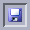  | 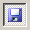  | 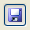  | 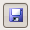  |
| 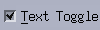   | 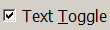   | 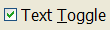   | 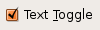   |
|  | 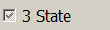 | 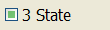 | 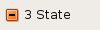 |
| 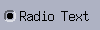  | 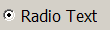  | 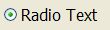  | 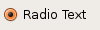  |

 

### See Also

[IupImage](iup_image.md), [IupButton](iup_button.md), [IupLabel](iup_label.md), [IupRadio](iup_radio.md), [IupFlatToggle](iup_flattoggle.md).
