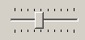
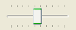
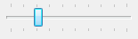
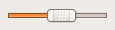
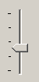
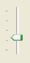
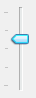

## IupVal

Creates a Valuator control. Selects a value in a limited interval.
Also known as Scale or Trackbar in native systems.

### Creation

    Ihandle* IupVal(const char *orientation);

**orientation**: optional orientation of valuator. Can be NULL. See ORIENTATION attribute.

**Returns:** the identifier of the created element, or NULL if an error occurs.

### Attributes

[BGCOLOR](../attrib/iup_bgcolor.md): transparent in all systems except in Motif.
It will use the background color of the native parent.

**CANFOCUS** (creation-only) (non-inheritable): enables the focus traversal of the control.
In Windows the control will still get the focus when clicked. Default: YES.

**PROPAGATEFOCUS**(non-inheritable): enables the focus callback forwarding to the next native parent with FOCUS_CB defined.
Default: NO.

**INVERTED**: Invert the minimum and maximum positions on screen.
When INVERTED=YES maximum is at top and left (minimum is bottom and right), when INVERTED=NO maximum is at bottom and right (minimum is top and left).
The initial value depends on ORIENTATION passed as parameter on creation, if ORIENTATION=VERTICAL default is YES, if ORIENTATION=HORIZONTAL default is NO.
On Cocoa, INVERTED is read-only for vertical orientation due to NSSlider limitations.

**MAX**: Contains the maximum valuator value. Default is "1".
When changed the display will not be updated until VALUE is set.

**MIN**: Contains the minimum valuator value. Default is "0".
When changed the display will not be updated until VALUE is set.

**PAGESTEP**: Controls the increment for PgDn and PgUp keys. It is not the size of the increment.
The increment size is "pagestep*(max-min)", so it must be 0<pagestep<1. Default is "0.1".

[RASTERSIZE](../attrib/iup_rastersize.md) (non-inheritable): The initial size is 100 pixels along the major axis, and the handler normal size on the minor axis.
If there are ticks then they are added to the natural size on the minor axis.
The handler can be smaller than the normal size.
Set to NULL to allow the automatic layout to use smaller values.

**SHOWTICKS**: The number of tick marks along the valuator trail.
Minimum value is "2". Default is "0", in this case the ticks are not shown.
It cannot be changed to 0 from a non-zero value, or vice versa, after the control is mapped.
Not supported in GTK 3 and EFL.

**STEP**: Controls the increment for keyboard control and the mouse wheel. It is not the size of the increment.
The increment size is "step*(max-min)", so it must be 0<step<1. Default is "0.01".

**TICKSPOS** (creation-only): Allows to position the ticks in both sides (BOTH) or in the reverse side (REVERSE).
Default: NORMAL. The normal position for horizontal orientation is at the top of the control, and for vertical orientation is at the left of the control.
In Motif, the ticks position is always normal.
Not supported in GTK 3 and EFL.

**ORIENTATION** (creation-only) (non-inheritable):  Informs whether the valuator is "VERTICAL" or "HORIZONTAL".
Vertical valuators are bottom to up, and horizontal valuators are left to right variations of min to max (but can be inverted using INVERTED).
Default: "HORIZONTAL".

**VALUE** (non-inheritable): Contains a number between MIN and MAX, indicating the valuator position.
Default: "0.0".

> 
>
> ------------------------------------------------------------------------

[ACTIVE](../attrib/iup_active.md), [EXPAND](../attrib/iup_expand.md), [FONT](../attrib/iup_font.md), [SCREENPOSITION](../attrib/iup_screenposition.md), [POSITION](../attrib/iup_position.md), [MINSIZE](../attrib/iup_minsize.md), [MAXSIZE](../attrib/iup_maxsize.md), [WID](../attrib/iup_wid.md), [TIP](../attrib/iup_tip.md), [SIZE](../attrib/iup_size.md), [ZORDER](../attrib/iup_zorder.md), [VISIBLE](../attrib/iup_visible.md), [THEME](../attrib/iup_theme.md): also accepted. 

### Callbacks

**VALUECHANGED_CB**: Called after the value was interactively changed by the user.

    int function(Ihandle *ih);

**ih**: identifier of the element that activated the event.

> 
>
> ------------------------------------------------------------------------

[MAP_CB](../call/iup_map_cb.md), [UNMAP_CB](../call/iup_unmap_cb.md), [DESTROY_CB](../call/iup_destroy_cb.md), [GETFOCUS_CB](../call/iup_getfocus_cb.md), [KILLFOCUS_CB](../call/iup_killfocus_cb.md), [ENTERWINDOW_CB](../call/iup_enterwindow_cb.md), [LEAVEWINDOW_CB](../call/iup_leavewindow_cb.md), [K_ANY](../call/iup_k_any.md), [HELP_CB](../call/iup_help_cb.md): All common callbacks are supported.

### Notes

This control replaces the old IupVal implemented in the additional controls.
The old callbacks are still supported but called only if the VALUECHANGED_CB callback is not defined.
The MOUSEMOVE_CB callback is only called when the user moves the handler using the mouse.
The BUTTON_PRESS_CB callback is called only when the user press a key that changes the position of the handler.
The BUTTON_RELEASE_CB callback is called only when the user release the mouse button after moving the handler.

In Motif, after the user clicks the handler a KILLFOCUS will be ignored when the control loses its focus.

In GTK uses GtkScale, in Windows uses TRACKBAR_CLASS, in WinUI uses XAML Slider, in macOS uses NSSlider, in Qt uses QSlider, in FLTK uses Fl_Slider, in EFL uses Efl_Ui_Slider, and in Motif uses xmScale.

#### Keyboard Mapping

This is the default mapping when INVERTED has the default value, or ORIENTATION=HORIZONTAL+INVERTED=NO.

|                          |                                        |
|--------------------------|----------------------------------------|
| Keys                     | Action for HORIZONTAL                  |
| Right Arrow              | move right, increment by one step      |
| Left Arrow               | move left, decrement by one step       |
| Ctrl+Right Arrow or PgDn | move right, increment by one page step |
| Ctrl+Left Arrow or PgUp  | move left, decrement by one page step  |
| Home                     | move all left, set to minimum          |
| End                      | move all right, set to maximum         |

This is the default mapping when INVERTED has the default value, or ORIENTATION=VERTICAL+INVERTED=YES.

|                         |                                       |
|-------------------------|---------------------------------------|
| Keys                    | Action for VERTICAL                   |
| Up Arrow                | move up, increment by one step        |
| Down Arrow              | move down, decrement by one step      |
| Ctrl+Up Arrow or PgUp   | move up, increment by one page step   |
| Ctrl+Down Arrow or PgDn | move down, decrement by one page step |
| Home                    | move all up, set to maximum           |
| End                     | move all down, set to minimum         |

Visually, all the keys move to the same direction independent of the INVERTED attribute.

Semantically, all the keys change the value depending on the INVERTED attribute.

This behavior is slightly different from the behavior defined by the native systems (Home and End keys are different).
But it is the same in all systems.

### Examples

[Browse for Example Files](../../examples/)

|                                  |                                    |                                    |                                    |                                  |
|----------------------------------|------------------------------------|------------------------------------|------------------------------------|----------------------------------|
| Motif                            | Windows Classic                    | Windows w/ Styles                  | Windows Vista                      | GTK                              |
|  |  |  |  |  |
|   |   |   |   |   |

### See Also

[IupFlatVal](../ctrl/iup_flatval.md), [IupScrollbar](iup_scrollbar.md), [IupDial](iup_dial.md)
