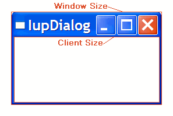
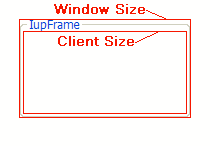
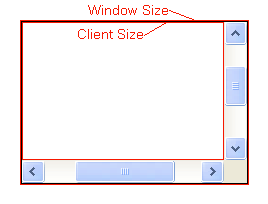
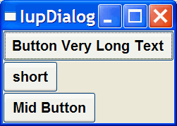
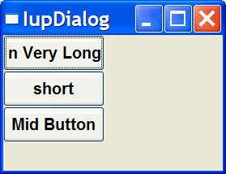
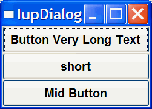
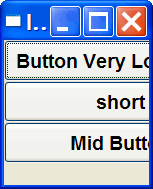
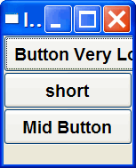

# Layout Composition

### Abstract Layout

Most interface toolkits employ the concrete layout model; that is, control positioning in the dialog is absolute in coordinates relative to the top-left corner of the dialog's client area.
This makes it easy to position the controls on it by using an interactive tool usually provided with the system.
It is also easy to dimension them. Of course, this positioning intrinsically depends on the graphics system's resolution.
Moreover, when the dialog size is altered, the elements remain in the same place, thus generating an empty area below and to the right of the elements.
Besides, if the graphics system's resolution changes, the dialog inevitably will look larger or smaller according to the resolution increase or decrease.

IUP implements an abstract layout concept, in which the positioning of controls is done relatively instead of absolutely.
For such, composition elements are necessary for composing the interface elements.
They are boxes and fillings invisible to the user, but that play an important part.
When the dialog size changes, these containers expand or retract to adjust the positioning of the controls to the new situation.

Watch the codes below. The first one refers to the creation of a dialog for the Microsoft Windows environment using its own resource API.
The second uses IUP. Note that, apart from providing the specification greater flexibility, the IUP specification is simpler, though a little larger.
In fact, creating a dialog on IUP with several elements will force you to plan your dialog more carefully – on the other hand, this will actually make its implementation easier.

Moreover, this IUP dialog has an indirect advantage: if the user changes its size, the elements (due to being positioned on an abstract layout) are automatically re-positioned horizontally.

The composition elements include vertical boxes (**vbox**), horizontal boxes (**hbox**) and filling (**fill**).
There is also a depth box (**zbox**) in which layers of elements can be created for the same dialog, and the elements in each layer are only visible when that given layer is active.

## Layout Guide

### Native Sizes (Window and Client)

Because of the dynamic nature of the abstract layout, IUP elements have implicit many types of size.
But the native elements have only two types of size: **Window** and **Client**.
The **Window** size reflects the bounding rectangle of the element.
The **Client** size reflects the inner size of the window that excludes the decorations and margins.
For many elements these two sizes are equal, but for many containers they are quite different.
See some examples below.

The IUP sizes (**User**, **Natural** and **Current**) described below are all related to the **Window** size.

The native **Client** size is used only internally to reposition the elements in the abstract layout, but it is available using the [CLIENTSIZE](attrib/iup_clientsize.md) attribute.

### IUP Sizes

#### Natural Size

IUP does not require that the application specifies the size of any element.
The sizes are automatically calculated so the contents of each element are fully displayed.
This size is called **Natural** size. The **Natural** size is calculated just before the element is mapped to the native system and every time **IupMap** is called, even if the element is already mapped.

The **Natural** size of a container is the size that allows all the elements inside the container to be fully displayed.
Then the **Natural** size is calculated from the inner element to the outer element (the dialog).
**Important**: even if the element is invisible, its size will be included in the size of its containers, except when FLOATING=Yes.

So consider the following code and its result. Each button size is large enough to display their respective text.
If the dialog size is increased or reduced by the size handlers in the dialog borders, the buttons do not move or change their sizes.

But notice that some controls do not have contents that can provide a **Natural** size.
In this case, they usually have SIZE or RASTERSIZE pre-set.

To obtain the last computed **Natural** size of the control in pixels, use the read-only attribute [NATURALSIZE](attrib/iup_naturalsize.md).

#### User Size

When the application defines the [SIZE](attrib/iup_size.md) or [RASTERSIZE](attrib/iup_rastersize.md) attributes, it changes the **User** size in IUP.
The initial internal value is "0x0". When set to NULL, the **User** size is internally set to "0x0".
If the element is **not mapped** then the returned value by SIZE or RASTERSIZE is the **User** size, if the element is mapped then the returned value is the **Current** size.
To obtain the **User** size after the element is mapped use the USERSIZE attribute.

By default, the layout computation uses the **Natural** size of the element to compose the layout of the dialog, but if the **User** size is defined, then it is used **instead** of the **Natural** size.
In this case, the **Natural** size is not even computed. But there are two exceptions.

If the element is a container (not including the dialog), the **User** size will be used **instead** of the **Natural** size **only** if **bigger** than the **Natural** size.
So for containers, the **User** size will also act as a minimum value for **Natural** size.

For the dialog, if the **User** size is defined then it is used **instead** of the **Natural** size, but the **Natural** size of the dialog is always computed.
And if the **User** size is not defined, the **Natural** size is used only if **bigger** than the **Current** size, so in this case, the dialog will always increase its size to fit all its contents.
In other words, in this case the dialog will not shrink its Current size unless the **User** size is defined.
See the SHRINK attribute guide below for an alternative.

When the user is interactively changing the dialog size, the **Current** size is updated.
But the dialog contents will always occupy the Natural size available, being smaller or bigger than the dialog **Current** size.

When SIZE or RASTERSIZE attributes are set for the dialog (changing the **User** size) the **Current** size is also reset to "0x0".
Allowing the application to force an update of its **Window** size.
To only change the **User** size in pixels, without resetting the **Current** size, set the USERSIZE attribute.

#### Current Size

After the **Natural** size is calculated for all the elements in the dialog, the **Current** size is set based on the available space in the dialog.
So the **Current** size is set from the outer element (the dialog) to the inner element, in opposite of what it is done for the **Natural** size.

After all the elements have their **Current** size updated, the element positions are calculated, and finally, after the element is mapped, the **Window** size and position are set for the native elements.
The **Window** size is set exactly to the **Current** size.

After the element is mapped, the returned value for SIZE or RASTERSIZE is the **Current** size.
It actually returns the native **Window** size of the element.
Before mapping, the returned value is the **User** size.

Defining the SIZE attribute of the buttons in the example, we can make all have the same size.

So when EXPAND=NO (see below) for elements that are not containers if **User** size is defined, then the **Natural** size is ignored.

If you want to adjust sizes in the dialog do it after the layout size and positioning are done, i.e., after the dialog is mapped or after **IupRefresh** is called.

#### EXPAND

Another way to increase the size of elements is to use the EXPAND attribute.
When there is room in the container to expand an element, the container layout will expand the elements that have the EXPAND attribute set to YES, HORIZONTAL or VERTICAL accordingly, even if they have the **User** size defined.

The default is EXPAND=NO, but for containers is EXPAND=YES.

So for elements that are NOT containers, when EXPAND is enabled the **Natural** size and the **User** size are ignored.

For containers, the default behavior is to always expand or if expand is disabled, they are limited to the **Natural** size.
As a consequence (if the **User** size is not defined in all the elements) the dialog contents can only expand and its minimum size is the **Natural** size, even if EXPAND is enabled for its elements.
In fact, the actual dialog size can be smaller, but its contents will stop to follow the resize, and they will be clipped at right and bottom.

If the expansion is in the same direction of the box, for instance expand="VERTICAL" in the Vbox of the previous example, then the expandable elements will receive equal spaces to expand according to the remaining empty space in the box.
This is why elements in different boxes does not align perfectly when EXPAND is set.

#### SHRINK

To reduce the size of the dialog and its containers to a size smaller than the **Natural** size, the SHRINK attribute of the dialog can be used.
If set to YES, all the containers of the dialog will be able to reduce its size.
But be aware that elements may overlap and the layout result could be visually bad if the dialog size is smaller than its **Natural** size.

The picture shown was captured after manually resizing the dialog.
So when using SHRINK, usually you will also need to set the dialog initial size.

### Layout Hierarchy

The layout of the elements of a dialog in IUP has a natural hierarchy because of the way they are composed together.

To create a node, simply call one of the pre-defined constructors like **IupLabel**, **IupButton**, **IupCanvas**, and so on.
To create a branch, just call the constructors of containers like **IupDialog**, **IupFrame**, **IupVBox**, and so on.
Internally, they all call [IupCreate](func/iup_create.md) to create branches or nodes.
To destroy a node or branch call [IupDestroy](func/iup_destroy.md).

Some of the constructors already append children to its branch, but you can add other children using [IupAppend](func/iup_append.md) or [IupInsert](func/iup_insert.md).
To remove from the tree, call [IupDetach](func/iup_detach.md).

For the element to be visible, [IupMap](func/iup_map.md) must be called so it can be associated with a native control.
**IupShow**, **IupShowXY** or **IupPopup** will automatically call **IupMap** before showing a dialog.
To remove this association, call [IupUnmap](func/iup_unmap.md).

But there is a call order to be able to call these functions that depend on the state of the element.
As you can see from these functions, there are 3 states: **created**, **appended** and **mapped**.
From **created** to **mapped** it is performed one step at a time.
Even when the constructor receives the children as a parameter **IupAppend** is called internally.
When you **detach** an element it will be automatically **unmapped** if necessary.
When you **destroy** an element it will be automatically **detached** if necessary.
So explicitly or implicitly, there will be always a call to:

    IupCreate  -> IupAppend -> IupMap
    IupDestroy <- IupDetach <- IupUnmap

A more simple and fast way to move an element from one position in the hierarchy to another is using [IupReparent](func/iup_reparent.md).

The dialog is the root of the hierarchy tree.
To retrieve the dialog of any element, you can simply call [IupGetDialog](func/iup_getdialog.md), but there are other ways to navigate in the hierarchy tree.

To get all the children of a container, call [IupGetChild](func/iup_getchild.md) or [IupGetNextChild](func/iup_getnextchild.md).
To get just the next control with the same parent use [IupGetBrother](func/iup_getbrother.md).
To get the parent of a control call [IupGetParent](func/iup_getparent.md).

### Layout Display

The layout size and positioning are automatically updated by **IupMap**.
**IupMap** also updates the dialog layout even if it is already mapped, so using it or using **IupShow**, **IupShowXY** or **IupPopup** (they all call **IupMap**) will also update the dialog layout.
The layout size and positioning can be manually updated using [IupRefresh](func/iup_refresh.md), even if the dialog is not mapped.

After changing container attributes or element sizes that affect the layout, the elements are NOT immediately repositioned.
Call **IupRefresh** for an element inside the dialog to update the dialog layout.

The Layout update is done in two phases.
First the layout is computed, this can be done without the dialog being mapped.
Second is the native elements update from the computed values.

The Layout computation is done in 3 steps: **Natural** size computation, update the **Current** size and update the position.

- The **Natural** size computation is done from the inner elements up to the dialog (first for the children then the element). **User** size (set by RASTERSIZE or SIZE) is used as the **Natural** size if defined, if not usually the contents of the element are used to calculate the **Natural** size.
- Then the **Current** size is computed starting at the dialog down to the inner elements on the layout hierarchy (first the element then the children). Children **Current** size is computed according to layout distribution and container decoration. At the children if EXPAND is set, then the size specified by the parent is used, else the natural size is used.
- Finally, the position is computed starting at the dialog down to the inner elements on the layout hierarchy, after all sizes are computed.

### Element Update

Usually IUP automatically updates everything for the application; for instance, there is no need to force a display update after an attribute is changed.
But there are some situations where you need to force an update.
Here is a summary of the functions that can be used to update an element state:

[IupUpdate](func/iup_update.md) - update the element look by letting the system schedule a redraw.

[IupRedraw](func/iup_redraw.md) - has the same effect of **IupUpdate** but forces the element to redraw now.

[IupRefresh](func/iup_refresh.md) - if the application changes some attribute that affects the natural size, for instance SIZE or RASTERSIZE among others, the actual element size is NOT immediately updated.
That's because it can affect the size and position of other elements in the dialog.
**IupRefresh** will force an update in the layout of the whole dialog, and of course, if an element has its size changed, its appearance will be automatically updated.

[IupFlush](func/iup_flush.md) - process all events that are waiting to be processed.
When you set an attribute, a system event is generated, but it will wait until is processed by the event loop.
Sometimes the application needs an immediate result, so calling **IupFlush** will process that event but it will also process every other event that was waiting to be processed, so other callbacks could be triggered during **IupFlush** call.
