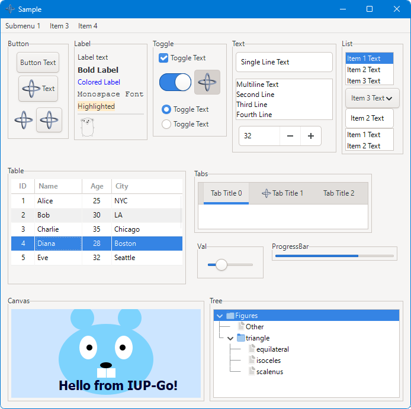
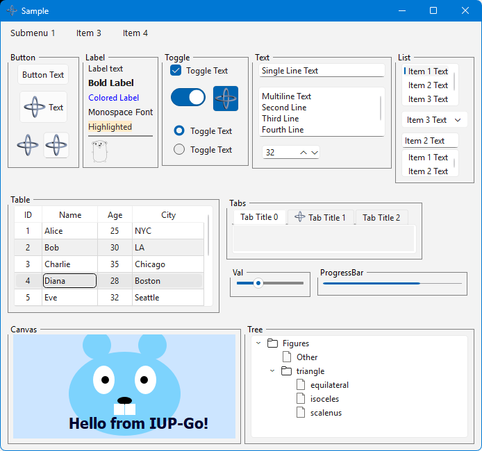
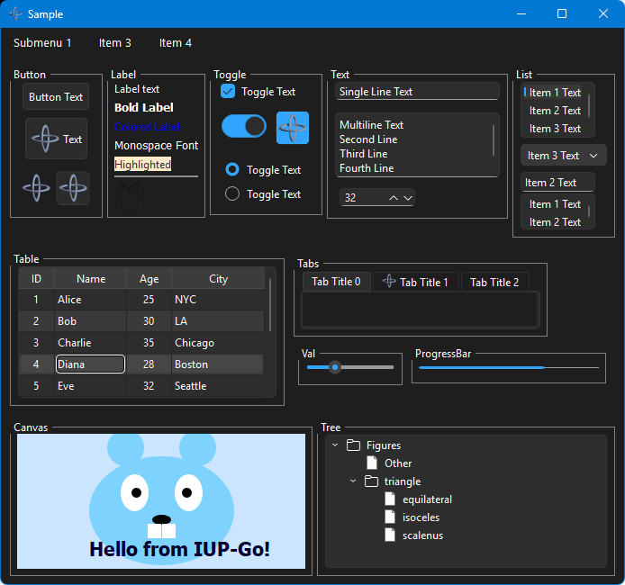
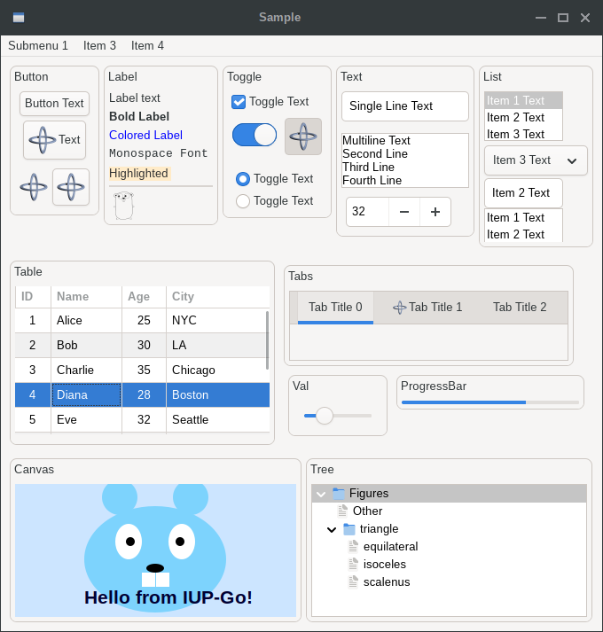
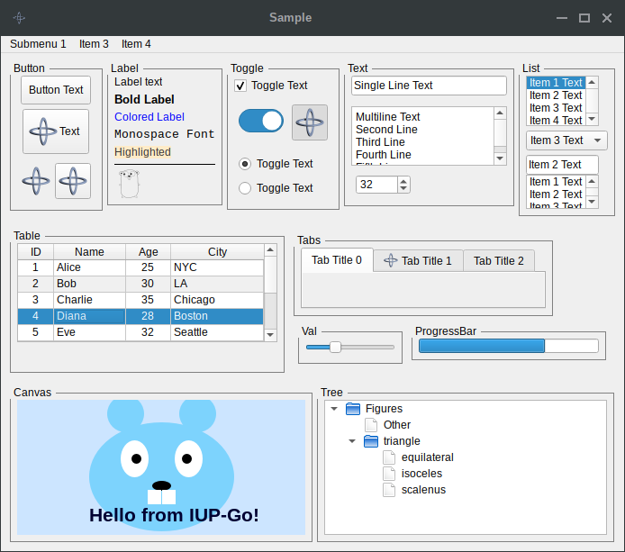
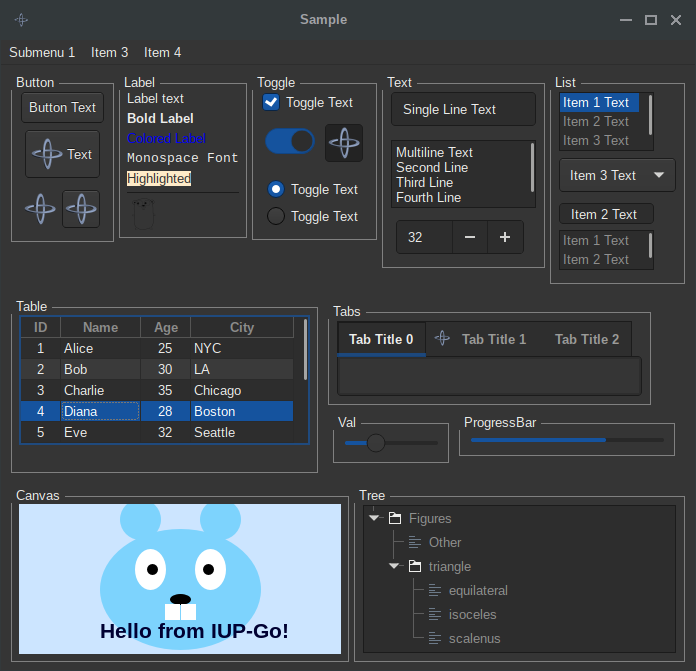
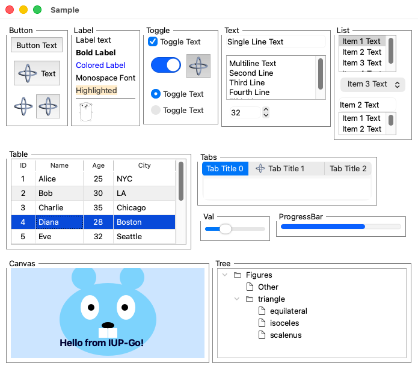
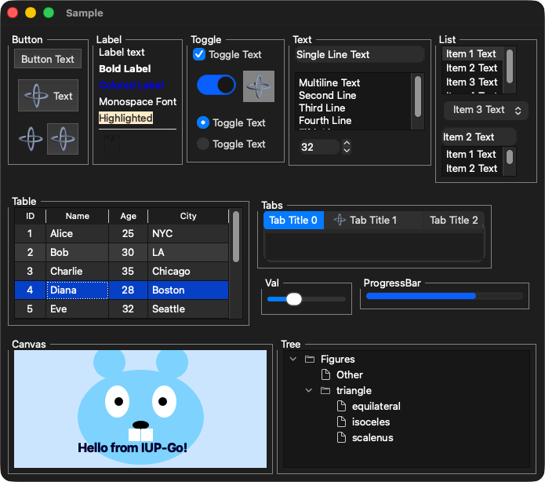

## Screenshots

### Windows Win32

### Windows GTK3

### Windows Qt6

### Windows Qt6 Dark

### macOS Cocoa

### macOS Cocoa Dark

### Linux GTK2

### Linux GTK3

### Linux GTK3 Dark

### Linux GTK4

### Linux Qt5

### Linux Qt6

### Linux Qt6 Dark

### macOS GTK3

### macOS Qt6

### macOS Qt6 Dark

### Motif

### Motif Dark

